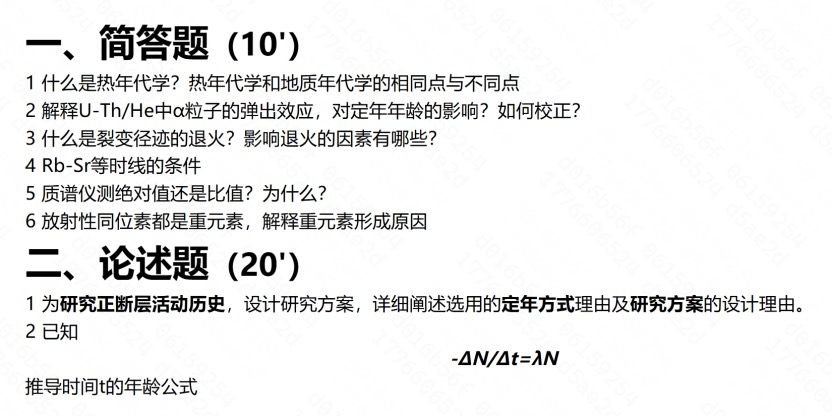
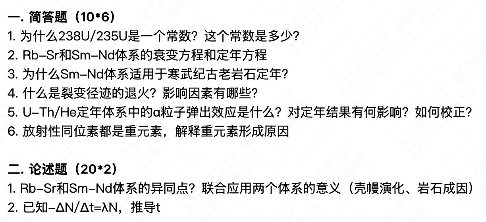

# 地质年代学

## 课程简介

本人上的是2025-2026春学期的，老师是龚俊峰和郝艳涛老师，成绩91/4.5。

这门课虽然说一开始介绍说需要岩石学基础之类的，不过没上过这些所谓预修课程也没关系，主要讲了许多不同定年方法的原理、操作、应用等；整体课程逻辑还是很清楚的，一开始上基础的（元素演化、同位素基本原理、定年公式）然后开始讲不同定年方法（氩-氩定年、铀钍铅定年、裂变径迹、铷-锶定年等），考前最后一次课郝老师很快速地提了一些重点知识的方向。不过我主要是按照ppt整理的笔记，上课虽然认真听了但是课上记忆的知识点毕竟有限。然后龚老师上课的时候喜欢提问题（可能相当于小测？）就是自己准备纸笔写好答案上交（感觉有些部分前面的内容其实在选修课“现代分析技术”里面也有讲），也是算作业分的（30%）。考试是闭卷，最后一次课上随堂测形式。

## 笔记/考试复习资料

<iframe
src="/university-notes-site/courses/major-elective/geochronology/files/geochronology-notes.pdf"
width="100%"
height="900px">
</iframe>

## 历年卷

