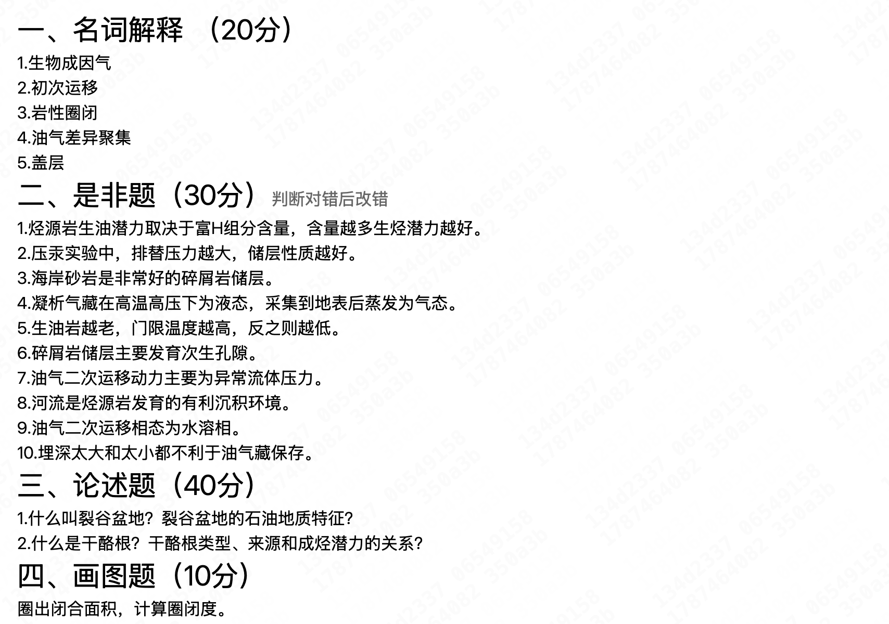
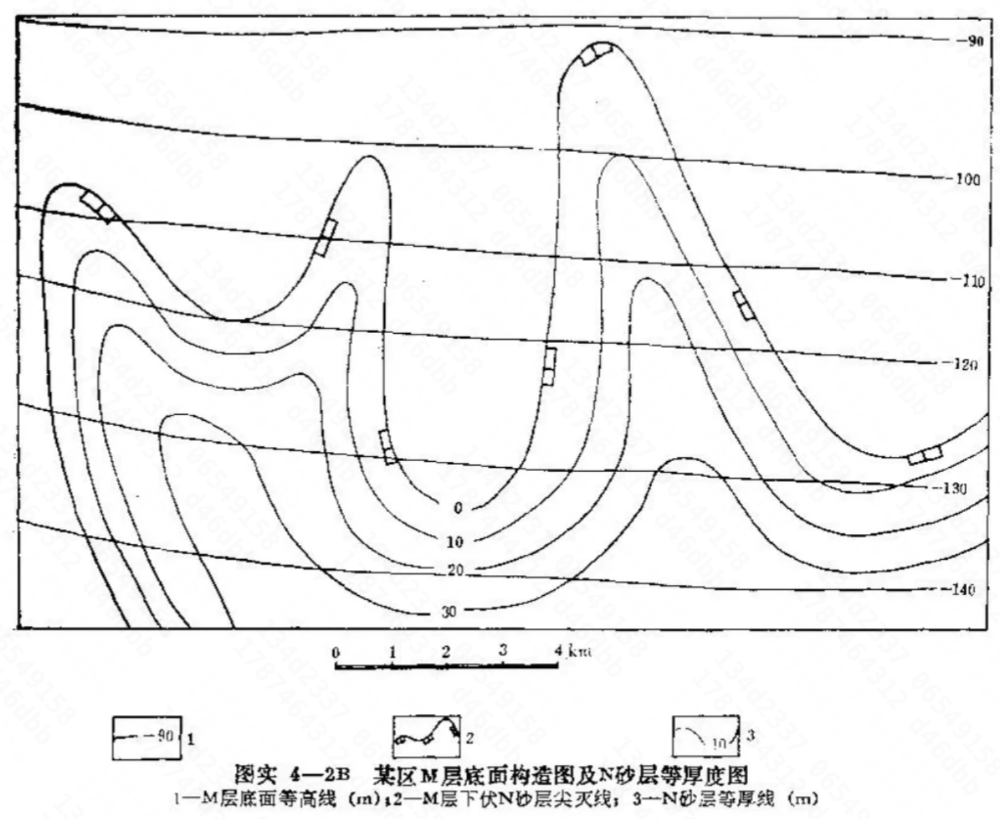

# 石油地质学

## 课程简介

本人上的是2025-2026夏学期何光玉老师的，成绩88/4.2；平时上课老师除了讲ppt（甚至用的还是西北大学地质学系的ppt）之外老喜欢扯其他的话，然后有三次作业，第一次交老师只是大致看一下然后就当场课上发回来让我们修改，第二次才是正式上交。考试是最后一次课随堂开卷考试（题型见下面回忆卷），大部分题目都能轻松找到课本上原话。

## 回忆卷2025-2026夏学期

（来自cc98 @山顶洞中人）

