# 绪论

## 实习区区域**地质**背景

新生代印度板块与欧亚板块持续碰撞，引起青藏高原强烈的地壳缩短、增厚以及变形；青藏高原的东北缘（具体来说是甘肃-青海一带）虽然远离碰撞发生区域，但仍发生了较为强烈的韧性与脆性变形作用并且持续向东以及东北方向扩展\[1\]，其中尤为重要的是阿尔金走滑断裂和祁连山逆冲构造系统（如[图 1-1](#_Ref320879677)）。前者是一个大型的左旋走滑断裂带，即断裂两侧相对主要以水平错动为主，后者则是主要以逆冲推覆为主，地壳在此处发生一系列的褶皱变形、缩短增厚和隆升。

<figure>

<figcaption>
图 1-1青藏高原及邻区地形与主要活动断裂分布图[1]
</figcaption>
</figure>

### 北祁连山-酒西盆地逆冲-褶皱构造系统

北祁连山是青藏高原东北缘的重要活动变形前锋，也是青藏高原的东北边界，其西段与阿尔金走滑断裂相接，其北侧为河西走廊西部的酒泉盆地。北祁连山与酒泉盆地之间形成显著的盆山地形反差，山前发育一系列总体呈NWW向展布的新生代逆冲断裂和褶皱，构成北祁连山前冲断系统。晚新生代以来，逆冲变形逐渐影响酒西盆地内部，使新生代地层卷入褶皱—冲断作用，并形成老君庙、石油沟、石油河等构造带\[2\]（如[图 1-2](#_Ref321619185)）。

沉积学、磁性地层和低温热年代学研究表明，北祁连山晚中新世以来经历明显的构造隆升和剥露，但不同方法对具体隆升的启动时间的约束存在一定差异，例如约10 Ma的快速冷却记录\[3\]以及约8-6.6 Ma以来的明显盆地沉积响应\[4\]均有被报道。

<figure>

<figcaption>
图 1-2 酒西盆地老君庙构造带地质简图[2]
</figcaption>
</figure>

### 阿尔金断裂左旋走滑构造系统

阿尔金断裂是青藏高原北缘最重要的大型左旋走滑断裂之一（如[图 1-3](#_Ref322274658)），现有地质和大地测量结果表明，阿尔金断裂滑动速率具有显著的沿走向空间变化：其中中西段总体约为10±3 mm/a，自约93°E向东逐渐衰减\[5\]。其中，阿尔金断裂的走滑速率在空间上的分布并非均匀的，整体而言向东呈现递减趋势，指示着部分走滑运动可能通过邻近逆冲断裂、褶皱或者分支断裂被重新分配\[6\]。实习中我们也根据阿克塞处河流阶地以及红柳峡中央断裂的的错移对走滑速率分别进行了计算。

<figure>

<figcaption>
图 1-3 阿尔金断裂及其周边构造环境[5]
</figcaption>
</figure>

## 地质实习的科学问题与研究思路

这次实习的核心问题很明确：青藏高原东北缘是怎么一步步往北长的？本文试图从两个角度入手——浅表看走滑和逆冲怎么搭配变形，深部看地壳结构支持哪种增厚模式，然后把两头的证据拼起来，结合野外研究与地物实验，从时间空间、浅地表以及深部地壳等多层面对其进行综合解释。

在时间演化方面，本文尝试研究走滑和逆冲的时间顺序：阿尔金断裂的左旋走滑与北祁连山逆冲-缩短作用之间是否存在明确的先后关系？二者之间是否会有一者引起另一者的因果关系？阿尔金走滑过程中可伴生逆冲变形，且祁连山北缘逆冲体系在后期又可能经历重新活化，二者关系可能远比简单的“先走滑、后逆冲”或者“先逆冲、后走滑”更复杂。

在空间关系上，观察到阿尔金断裂的走滑速率自西向东逐渐“减速”，而祁连山北缘的逆冲缩短却广泛发育。那么两者之间是否存在“此消彼长”的关系？故本次实习选取阿克塞段和红柳峡中央断裂，通过阶地错移量与定年估算走滑速率；同时结合老君庙背斜的几何恢复来量化地壳缩短，试图验证走滑“衰减”是否确实转化为逆冲“增强”。

地表响应方面，逆冲缩短不仅造成地层褶皱，更是驱动了山体隆升和水系重塑。我们重点分析了老君庙背斜的构造几何，并利用石油河阶地的河拔高度与年龄数据，试图厘清河流下切是对构造隆升的被动响应，还是存在气候等其他干扰因素。

深部地壳方面，祁连山下的岩石圈缩短，到底是均匀的纯剪切增厚，还是沿大型滑脱面的简单剪切俯冲，抑或者是二者复杂耦合？因此，为此，本次实习进一步引入地球物理实验：通过密集台阵远震接收函数、CCP成像及H–κ叠加分析地壳厚度和Moho结构的空间变化，为祁连山深部变形模式提供约束，尝试在浅表变形与深部结构之间建立有机关联。同时通过典型大型走滑断裂带的MT二维反演实验，认识走滑断裂深部电性结构及其地球物理响应，为理解大型走滑构造的深部特征提供补充。

最终，本次实习尝试将阿尔金断裂的走滑变形、祁连山北缘的逆冲缩短与隆升、红柳峡记录的走滑—逆冲构造关系以及地球物理实验揭示的深部地壳结构综合起来，从浅表到深部、从局部构造到区域尺度，讨论青藏高原东北缘的应变分配方式及其向北方向生长的构造机制。

## 实习内容介绍

为了探究青藏高原东北缘是如何持续向北扩展的问题，本次实习综合运用构造地质学与地球物理学方法，开展了系统的室内与野外实践工作。室内工作主要是遥感图像解译、专题讲座学习，以及地球物理地震数据处理相关的环境配置、代码脚本运行与软件操作。野外实地踏勘共计6天，研究区域从东到西依次为祁连山北缘、老君庙背斜（石油河阶地）、红柳峡、阿克塞南侧（阿尔金走滑断裂东段），如[图 1-4](#_Ref322829289)。

野外具体开展的工作内容包括：对阿尔金断裂阿克塞段和红柳峡中央断裂附近的段家沙河流阶地开展解译，通过阶地错移量与年代数据估算左旋走滑速率；通过老君庙背斜构造几何恢复估算北祁连山北缘的地壳缩短量，并利用石油河阶地河拔高度及年龄资料分析河流下切和隆升响应；在红柳峡开展地层、断层、褶皱等地质现象的野外观察、区域地质填图及图切地质剖面的编制；并且在以上工作的基础上，结合北祁连山—酒泉盆地相关的深部地球物理资料，从浅部构造与岩石圈尺度结构等层次综合认识青藏高原东北缘的变形特征。野外工作共采集产状数据34组（涵盖地层层面与断层面），系统观测并记录地质点位27处（包括岩性点、构造点、地貌点及界线点），同时手绘与电脑绘制素描图、剖面图等图件若干幅。

<figure>

<figcaption>
图 1-4 实习主要野外踏勘区域
</figcaption>
</figure>

（其中不同的线是构造活动断裂的遥感解译结果，绿色线为阿尔金走滑断裂，红色线则为根据地势高差、地貌、三角面等其他证据推测的断层；白色框为野外实习主要研究区域）

# 阿尔金断裂走滑变形

## 阿克塞段河流阶地错移与走滑速率

野外踏勘过程中，我们实地看到了阿克塞不同的河流阶地，并且纸质完成了河流阶地与陡坎等的填图（如[图 2-1](#_Ref323551990)），利用阿克塞段河流阶地（具体来说是陡坎部分）的错动位移并且结合相关文献的阶地年龄数据计算得到走滑速率。

具体而言，阿克塞的断裂穿过了河流阶地，阶地边缘的陡坎部分由于左旋走滑断层的发育发生了左旋的错移，我选择了T2阶地侧的陡坎错动计算错移量，先是从图上量得错动的位移量，然后结果比例尺的换算得到错移量约为57.57m以及T2的年龄5.81ka，根据公式$`v = \frac{D}{t}`$，最终得到走滑速率约为9.9m/ka（即9.9mm/a）。该结果表明（在误差允许范围内）阿克塞段在晚全新世以来仍保持强左旋走滑活动。

<figure>
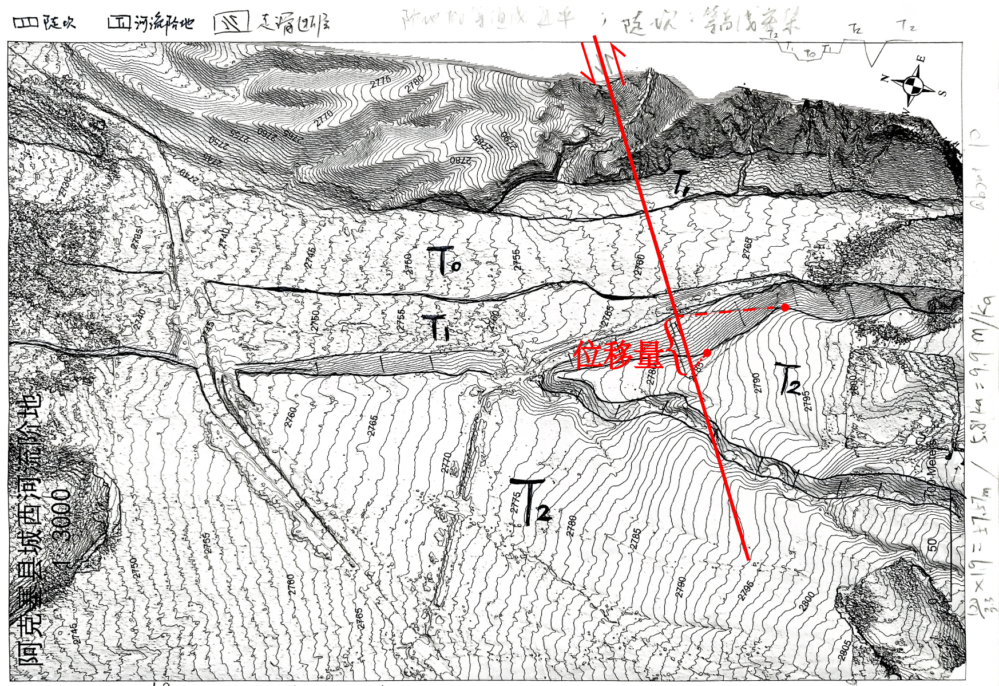
<figcaption>
图 2-1阿尔金断裂阿克塞段河流阶地错移及走滑速率估算图
</figcaption>
</figure>

## 红柳峡中央断裂阶地错移与走滑速率

类似的，红柳峡地区同样发育多级河流阶地，中央断裂横切阶地序列，并使部分阶地边缘产生明显的水平错移。根据遥感影像及填图结果（如[图 2-2](#_Ref323686446)），可识别出 T0—T3 等多级阶地，其中较老的 T3 阶地保存了较为清晰的断层错移地貌，因此选取其作为走滑位移恢复标志。

根据断层两侧 T3 阶地边缘的几何对应关系，恢复其受断裂错动前的位置，测得左旋水平错移

量约为 28 m，除以阶地年龄25.9ka，计算得到走滑速率值约1.08mm/a。与阿克塞段约 9.9 mm/a 的走滑速率相比，红柳峡中央断裂记录的走滑速率明显较低，说明阿尔金断裂东段的水平走滑变形并非沿走向均匀分布。二者之间的差异将在后文结合祁连山逆冲缩短作用进一步讨论。

<figure>
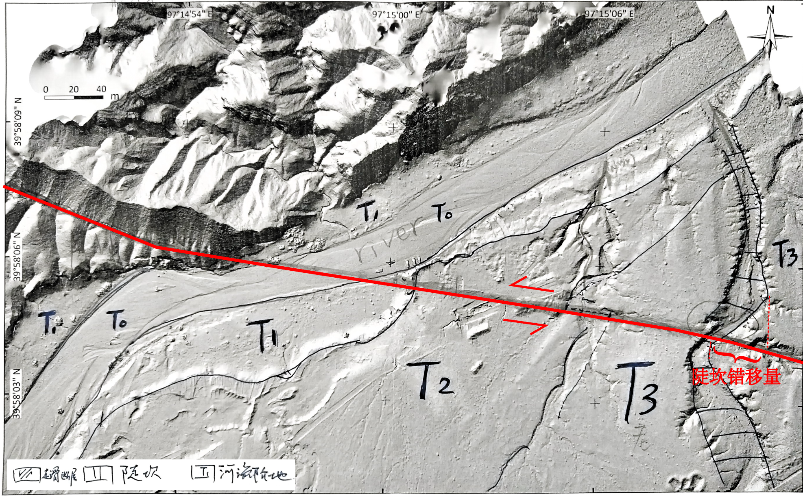
<figcaption>
图 2-2红柳峡中央断裂段家沙河流阶地错移及走滑速率估算图
</figcaption>
</figure>

# 祁连山北缘逆冲-缩短变形与隆升响应

## 老君庙背斜几何特征与浅部挤压缩短变形

老君庙背斜（相关文献中相关研究称 Yumen anticline）位于北祁连山前缘与酒泉盆地之间，是祁连山向北—东北方向扩展过程中形成的重要前缘褶皱构造。本次实习沿石油河阶地对老君庙背斜开展地质调查，根据地层产状及剖面测量结果绘制剖面（如[图 3-1](#_Ref323921744)），发现老君庙地区地层发生明显弯曲并且发育了膝折构造，两翼地层产状存在较大差异，整体表现为受近NE-SW向挤压形成的褶皱变形。并且背斜南侧地层主要向SSW倾斜约20°据此可以推测深部滑脱面也可能具有约20°的倾角\[7\]。

<figure>
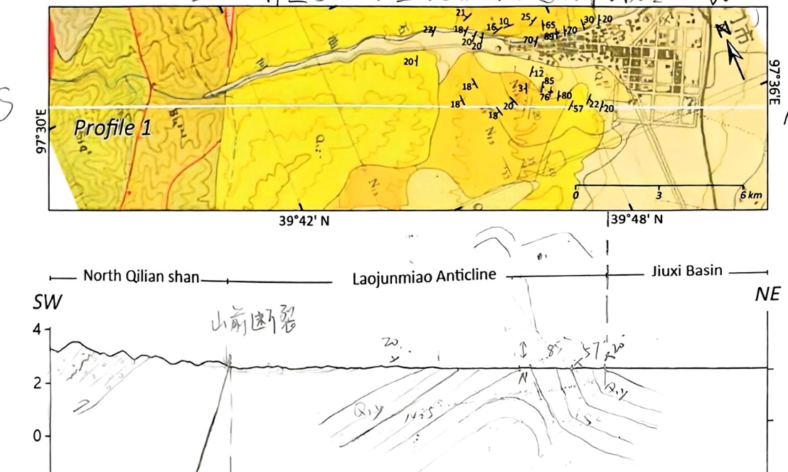
<figcaption>
图 3-1老君庙背斜地质构造及剖面特征图
</figcaption>
</figure>

综上，老君庙背斜本质上是北祁连山向酒泉盆地方向挤压扩展的浅部响应结果。换言之，当近SW-NE向水平挤压作用于祁连山-酒泉盆地边界时，深部逆冲滑动并未全部以地表断裂形式释放，而是部分通过应力传导使得上覆地层发生褶皱缩短、弯曲与隆升吸收，最终形成前缘背斜（如[图 3-2](#_Ref324207463)）。

<figure>
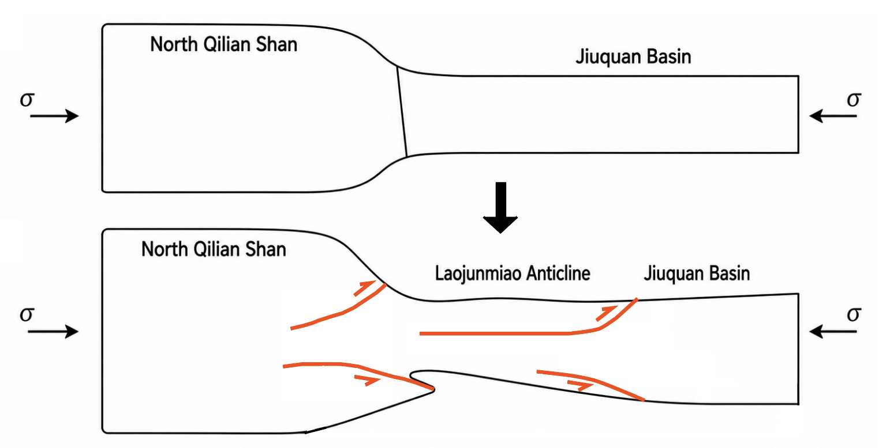
<figcaption>
图 3-2北祁连山-酒泉盆地前缘挤压缩短与老君庙背斜形成模式
</figcaption>
</figure>

## 石油河阶地河拔序列及其对构造隆升的约束

石油河自南向北切穿北祁连山前缘背斜，在晚第四纪持续下切过程中形成了多级河流阶地。根据 Hetzel et al. (2006) 的宇宙成因核素 ^10Be 暴露测年及黄土光释光年龄资料，石油河主要发育 T1、T2 和 T3 等阶地，其中高阶地总体形成较早、河拔较高，而低阶地形成较晚、河拔较低，构成较清楚的“年龄-河拔高度”序列\[7\]（如[图 3-3](#_Ref325787321)、[图 3-4](#_Ref326510022)）。

阶地序列散点图明显表明石油河下切并非以恒定速率进行。定量计算（其依据见[表 3-1](#_Ref351770943)）亦能支持该点——若以 T3（取中值年龄61 ka，河拔取180m）与 T2（年龄10.5 ka，河拔取中值120 m）之间的高差（约60 m）估算，晚更新世以来的平均下切速率约为 1.19 mm/a；而根据T2b与T1计算得到的下切速率快速增加至约13.2 mm/a（若是根据T2a与T1计算则是14.75 mm/a），较前一阶段突然增大了一个数量级。如此急剧加速几乎不可能是单纯的构造抬升速率突变所致，因此也表明着全新世石油河的快速下切除构造作用外，还受到气候变化等其他非构造因素的显著影响。

所以我们计算出的河流平均下切速率不等于构造抬升速率，前者是地貌过程的结果（侵蚀），后者则与构造过程的驱动力（隆升）相关；河流下切会受到隆升以及气候变化等多因素影响——这也意味着，石油河阶地虽然不能直接给出隆升速率，但是可以作为其上限来约束构造过程。在假设晚更新世下切完全由构造抬升控制的极端情况下，可以得到隆升速率的上限，即Hetzel et al. (2006) 指出的最大岩石抬升速率约为 0.8±0.2 mm/a；若采用约20°的滑脱面倾角，则对应最大水平缩短速率约为 2.2±0.5 mm/a\[7\]。

<figure>
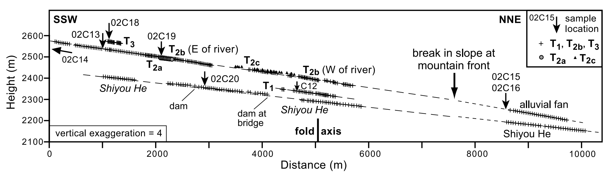
<figcaption>
图 3-3沿不同阶地及石油河测得的地形剖面[7]
</figcaption>
</figure>

表 3-1 石油河阶地年龄-河拔高度序列及其下切速率计算依据\[7\]

|                |              |                  |                 |
|----------------|--------------|------------------|-----------------|
| 阶地           | 年龄 t（ka） | 年龄误差 ±（ka） | 河拔高度 H（m） |
| 现代河床       | 0            | 0                | 0               |
| T₁             | 4.8          | 0.8              | 40              |
| T2b | 10.1         | 7.1              | 110             |
| T2a | 10.9         | 3.7              | 130             |
| T₃             | 61           | 10               | 180             |

（年龄数据来自Hetzel et al., 2006，河拔高度则是根据[图 3-3](#_Ref325787321)手动测量计算）

<figure>
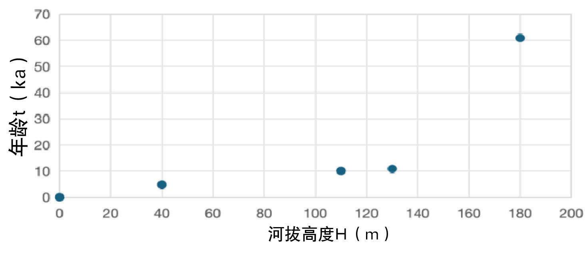
<figcaption>
图 3-4石油河河拔高度随阶地年龄变化散点图
</figcaption>
</figure>

# 红柳峡区域构造解析

## 红柳峡区域主要地层特征

红柳峡区域的地层由老到新依次为：志留系、火烧沟组、白杨河组、疏勒河组；填图区域还涉及上覆的玉门组砾岩以及酒泉砾岩等。

根据野外踏勘观察以及文献阅读——火烧沟组以红棕色—砖红色砾岩和含砾粗砂岩为主，代表冲积扇—河流冲积体系；白杨河组整体向上变细，下部以粗砂岩、含砾粗砂岩为主，上部逐渐转变为钙质粉砂岩和泥岩，并发育较多石膏夹层（例如野外实习期间，于红柳峡最高处观景平台发现大量石膏。结合该处岩性组合特征及遥感影像解译结果，推断该露点地层应归属于白杨河组），反映河流—冲积平原向浅湖环境的转变；疏勒河组下部以钙质粉砂岩、砂岩为主，向上砂质及含砾组分增加，总体表现为由浅湖向河流—冲积平原及冲积扇环境过渡。其上玉门砾岩、酒泉砾岩等主要由粗粒砾质沉积物组成，代表冲积扇扇中—扇根沉积\[8\]（如[图 4-1](#_Ref326913390)）。

不同的地层单元除了正常的地层接触之外，还存在着复杂的接触关系。志留系地层逆冲于火烧沟组之上；火烧沟组与背斜南侧的白杨河组之间存在断层接触，局部表现为断层及不整合关系；白杨河组向上与疏勒河组整合接触，最后是第四系的一些晚期覆盖，主要覆盖在一些后期被剥蚀的低洼区\[8\]。

鉴于本次实习聚焦于青藏高原北向扩展的生长机制，地层岩性并非研究核心，故在此仅作概要性的介绍，以作为区域构造分析的背景参照。

<figure>
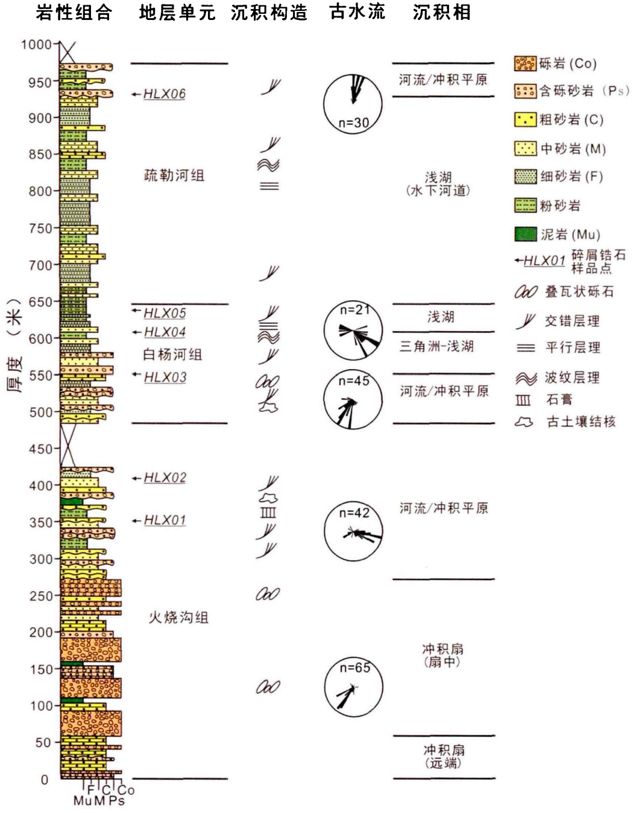
<figcaption>
图 4-1酒西盆地红柳峡剖面新生代地层综合柱状图[8]
</figcaption>
</figure>

## 红柳峡构造剖面及主要构造特征

通过野外实地观察我们发现红柳峡地区地层出露较为完整，并且发育多条较为复杂的走滑以及逆冲断层。为厘清研究区主要地层单元的空间展布、断裂几何形态及褶皱变形特征，本次实习结合遥感影像与野外观察，对红柳峡地区进行了地质填图，并在此基础上布置 A–B 和 C–D 两条地质剖面（如[图 4-2](#_Ref327333565)、[图 4-3](#_Ref327787354)）。

填图结果发现，红柳峡处于阿尔金断裂东端与北祁连山构造体系的耦合及转换区域，构造变形呈现出明显的走滑及挤压的复合特征，走滑与挤压分量的共同作用，使该区域表现出明显的压扭性变形特征——其中的挤压应力造成了地壳的明显缩短，例如志留系逆冲至第四系之上，剖面构造缩短量 \>3 km\[9\]，这也与前人地震反射剖面揭示的红柳峡地区逆冲断裂及其相关背斜-向斜构造，在构造样式上具有较好的一致性（如[图 4-4](#_Ref328879809)） 。除了断裂变形之外，区域内还广泛发育褶皱变形——南部的背斜以及北部主要由疏勒河组构成的向斜，二者轴迹虽然总体都是近东西向延伸但并不是完全平行的，而是有一个斜交的几何关系。并且不难发现，在该背斜的南翼，本该像疏勒河下段一样地层界限较为平直的白杨河组地层发生了明显弯曲，即此处形成了一个小褶皱，偏西南侧为背斜。偏东北侧为向斜。

从区域尺度看，这种构造样式可能反映了阿尔金断裂向东延伸过程中走滑位移逐渐减弱，并通过逆冲、褶皱等方式以及其他派生断层与次级构造向北祁连山—酒西盆地一带的缩短变形进行转换和分配。

至于这些构造的时间先后关系，本文推测大褶皱的形成与中部的走滑断层（[图 4-2](#_Ref327333565)中红色虚线部分）有关，而大背斜南翼的小褶皱的形成则与南部的逆冲断层有关，因此可得，中部走滑断层的形成早于南部逆冲断层。而对于北部贯穿东西的走滑断层，基于其北侧白垩系地层（K）基本无大型褶皱变形的南北部构造差异，推测其形成时间早于南部的断裂——综上，本文认为形成时间先后排序为：北侧大型走滑 ➞ 中部走滑断层（后期叠加了逆冲的性质）➞ 大褶皱（北侧为向斜，南侧为背斜）➞ 南侧逆冲断层 ➞ 南侧小褶皱（偏西南侧为小背斜，偏东北侧为小向斜）。

<figure>
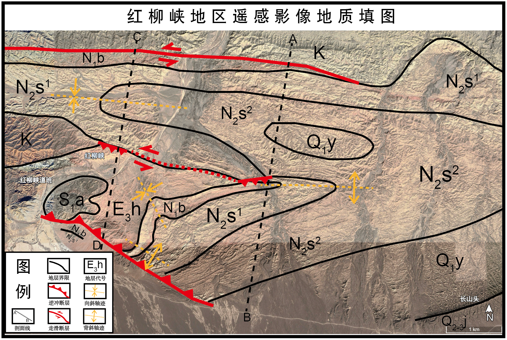
<figcaption>
图 4-2红柳峡地区构造地质遥感填图
</figcaption>
</figure>

<figure>
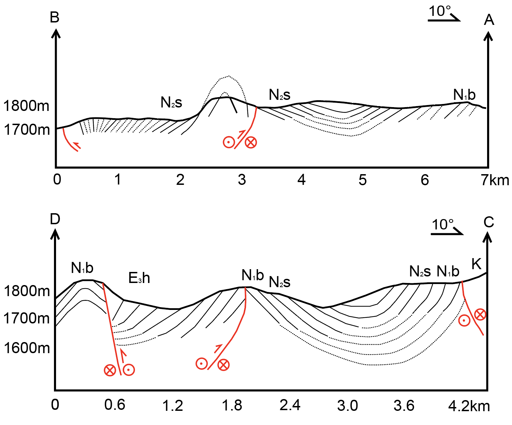
<figcaption>
图 4-3红柳峡地区A-B、C-D构造地质剖面
</figcaption>
</figure>

剖面图中黑色实线表示实测或较可靠确定的地层界线、层面；虚线表示推测的地层界限或层面，或被覆盖、侵蚀部分的地层延伸；红色实线：断层；红色箭头指示逆冲断层上盘运动方向

**符号“⊙”**：指示走滑断层方向，即运动方向垂直纸面向外，即朝向观察者。

符号“⊗”：指示走滑断层方向，运动方向垂直纸面向内，即背离观察者。

<figure>
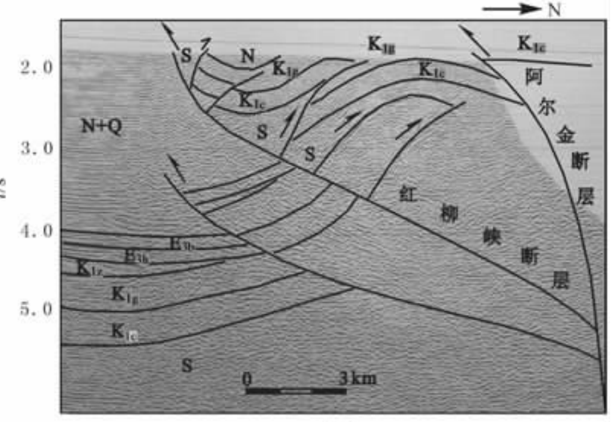
<figcaption>
图 4-4红柳峡断层与阿尔金断裂地震解释剖面[9]
</figcaption>
</figure>

# 青藏高原东北缘变形机制综合讨论

## 阿尔金走滑与祁连山逆冲的时空耦合与应变分配关系

关于阿尔金走滑断裂与祁连山逆冲断裂二者的地质关系，本文已经阐明了以下几类证据：

第一，阿克塞段（94°E-95°E ）得到约9.9 mm/a，而红柳峡中央断裂（97°E）仅约1.08 mm/a；第二，北祁连山-酒泉盆地一带广泛发育逆冲、褶皱和南北向的缩短：老君庙背斜表现为山前挤压缩短的浅部响应；第三，红柳峡区域同时发育走滑、逆冲和褶皱，表现出典型的压扭复合变形，并且逆冲断裂未向北继续延伸越过走滑断裂；第四，CCP 接收函数成像剖面中，祁连山深部地壳存在明显增厚。

时间上，由于现有证据尚不足以严格约束启动时序，目前仅猜测是时序模式 ① 与 ③ ，即走滑断裂是先于或者与逆冲同时启动（如[图 7-1](#_Ref348006175)）。空间上，阿尔金走滑变形沿东西向明显不均一，阿尔金断裂向东走滑活动减弱；这种走滑速率向断裂端部的降低意味着断裂周边区域必须发生内部变形以维持应变协调\[25\]，并且倘若阿尔金断裂走滑速率的降低是转化成为了祁连山山前缩短，那么缩短量理应随着前者的降低而等量增加，但现实情况是北祁连山前冲断带的晚第四纪缩短速率基本维持在1.8–2.2 mm/a\[26\]（如[图7-2](#_Ref315904805)）。

综合上述分析及证据，阿尔金断裂向东递减的走滑位移可能并非仅由北祁连山单一山前断裂的逆冲缩短所承担，而是在阿尔金断裂东端—祁连山构造转换区内发生了更广泛的应变重新分配。该应变主要通过祁连山内部多个近于平行的褶皱-冲断带、邻近前陆盆地（例如酒泉盆地等）的基底卷入型缩短以及分布式地壳缩短与增厚共同协调。

上述应变分配特征也与连续变形模型较为一致，即大型走滑断裂并非严格分隔刚性块体的边界，其走滑位移可沿走向逐渐衰减，并由断层端部及周缘较宽范围内的内部变形共同协调和吸收\[27\]。England and McKenzie（1982）提出的薄黏性板模型进一步将大陆岩石圈视为长时间尺度下可连续变形的介质，其内部流动受到外部边界作用力以及地壳厚度差异所产生内部力的共同影响\[28\]。据此，当大型走滑断裂向端部延伸、走滑位移逐渐衰减时，区域应变就可能通过断层周缘的逆冲、褶皱、地壳缩短增厚以及侧向物质运动等多种方式重新分配。

因此，祁连山地区所表现出的阿尔金走滑减弱与广泛逆冲缩短、地壳增厚并存的现象，可以理解为青藏高原东北缘在持续汇聚背景下进行分布式应变调节的结果。

<figure>
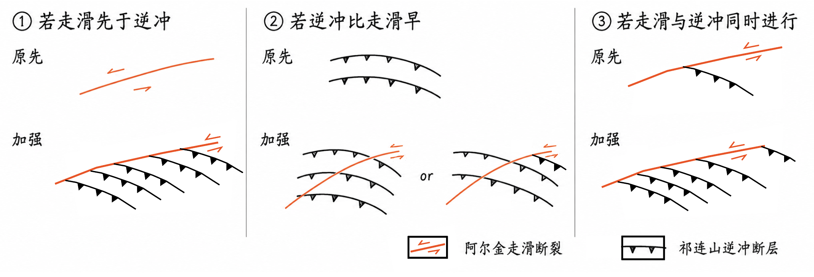
<figcaption>
图 7-1 阿尔金左旋走滑断裂与祁连山逆冲断层相互作用的可能时序模式示意图
</figcaption>
</figure>

<figure>
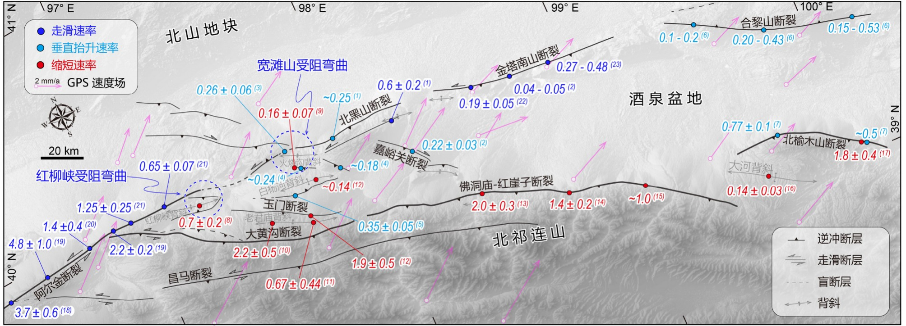
<figcaption>
图 7-2 北祁连山-酒泉盆地主要断层滑动速率汇编[26]
</figcaption>
</figure>

## 祁连山深部地壳岩石圈变形模式

第6章实验的 H–κ 叠加结果显示，研究区厚地壳台站的地壳厚度总体达到约 50-60 km；CCP 接收函数成像中约 50-60 km 深度存在较连续的 Moho 转换界面，并总体表现为祁连山一侧地壳较厚，指示祁连山经历了强烈的地壳缩短与地壳增厚过程。更重要的是，厚地壳区域总体对应较低的Vp/Vs。而Vp/Vs与地壳平均成分具有一定相关性——长英质-中性地壳的 Vp/Vs 相对较低，而基性物质比例升高通常会提高地壳平均 Vp/Vs。所以，祁连山地壳增厚不太可能主要由大量幔源基性岩浆底侵或基性物质向中下地壳增生造成，而更可能主要来源于原有大陆地壳自身在长期水平的近南北向挤压应力下的构造缩短与叠加增厚。

结合北祁连山广泛发育的逆冲-褶皱构造以及前人提出的深部构造模型，可以认为祁连山的深部变形虽然具有增厚趋势但并非简单的均匀垂向增厚，而具有明显的非对称汇聚特征——即祁连山深部地壳-岩石圈变形总体可概括为：以水平挤压和大陆地壳缩短增厚为主体，并可能通过构造楔式非对称汇聚\[26\]（即酒泉盆地下方的戈壁—阿拉善岩石圈作为刚性块体南向楔入与上地壳向北逆冲的耦合，如[图 7-3](#_Ref350157471)）实现岩石圈尺度的应变协调。

<figure>
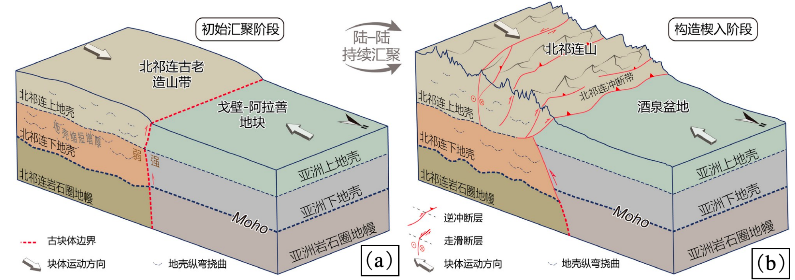
<figcaption>
图 7-3 北祁连山与戈壁-阿拉善地块内酒泉盆地之间的岩石圈尺度构造楔[26]（据李坤等，2025修改）
</figcaption>
</figure>

\(a\) 北祁连山相对较弱的岩石圈在汇聚初期可能通过纯剪机制在水平挤压下内部增厚. (b) 在持续汇聚过程中, 刚性的酒泉盆地楔入弱化的北祁连下地壳, 形成上地壳向盆地方向逆冲的厚皮断裂系统, 以及深部北倾错断莫霍面的深大断裂

## 青藏高原向北生长机制与综合构造模式

综合来看，青藏高原东北缘的向北生长是持续汇聚背景下区域应变不断向高原北缘传递、重新分配且最终被岩石圈内部吸收的过程。其中，走滑断裂主要承担水平运动的调节作用，而当走滑位移向断裂端部逐渐衰减时，剩余应变进一步分散到祁连山内部及其北缘较宽的构造带中，通过褶皱、逆冲、基底卷入和地壳缩短增厚等多种方式共同协调。因此，青藏高原东北缘的构造生长更接近一种“走滑调节-分布式缩短-地壳增厚”多元耦合的连续变形模式。这种模式意味着高原边界在持续挤压作用下，应变逐渐向外围传播，使原本位于高原边缘甚至高原之外的地区不断卷入变形。祁连山及其北缘由此成为吸收青藏高原东北向扩展应变的重要及主要构造带，并通过持续缩短、增厚和隆升实现高原地壳物质与地形边界的向北扩展。

而从更大的尺度来看，这种生长方式体现了青藏高原东北缘明显的渐进式、分布式扩展特征——即浅部表现为活动断裂和褶皱冲断带逐渐向外围发展，深部则表现为地壳缩短和增厚范围的扩展。二者共同作用，使青藏高原的变形前缘在长期构造演化过程中逐步向河西走廊及阿拉善方向传播。由此，本研究认为青藏高原东北缘的向北生长本质上是大陆内部连续变形条件下，应变由大型走滑断裂向宽广缩短变形带逐渐转移，并通过岩石圈尺度缩短增厚实现空间扩展的过程。

# 主要结论

本次实习综合野外地质调查、地貌定量分析及地球物理实验，对青藏高原东北缘走滑-逆冲构造及其深部响应进行了分析，主要得到以下认识：

（1）阿尔金断裂走滑速率向东明显降低。阿克塞段获得约 9.9 mm/a 的左旋走滑速率，而东部红柳峡中央断裂约为 1.08 mm/a，表明阿尔金断裂向东运动学作用显著减弱，反映其所承担的水平运动在高原东北缘发生了明显的应变重新分配。

（2）祁连山北缘是吸收区域缩短应变的重要构造带。老君庙背斜、逆冲断裂及石油河阶地序列共同表明北祁连山—酒泉盆地前缘经历了持续的挤压缩短、褶皱变形和构造隆升；但河流下切速率并不能简单等同于构造隆升速率，尤其晚期快速下切可能同时受到气候等地貌过程影响。

（3）红柳峡记录了典型的走滑—逆冲复合变形。区域内左旋走滑断裂、逆冲断裂及近东西向褶皱共同发育，表现出明显的压扭性构造特征，说明阿尔金走滑系统与祁连山逆冲系统并非彼此独立，而是在高原东北缘发生空间耦合和应变分配。

（4）深部地球物理结果支持祁连山地壳长期缩短增厚。CCP 成像及 H–κ 叠加表明祁连山一带地壳厚度总体可达约 50-60 km，厚地壳区域同时具有相对较低的 Vp/Vs，说明其增厚更可能主要来源于大陆地壳长期水平缩短和叠置，而不支持大量幔源基性物质底侵作为主导机制。

（5）青藏高原东北缘的扩展是走滑与逆冲缩短共同作用的结果。阿尔金断裂主要承担区域尺度的侧向运动和应变传递，而祁连山逆冲—褶皱系统则通过地壳缩短、增厚和隆升进一步吸收应变。因此，高原东北缘并非简单通过单一走滑或单一逆冲向外扩展，而是通过走滑—逆冲耦合及区域应变分配实现持续的北东向生长。
