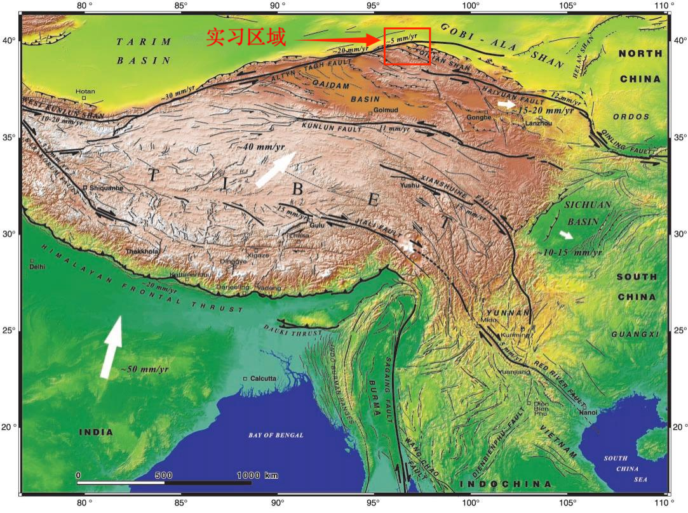
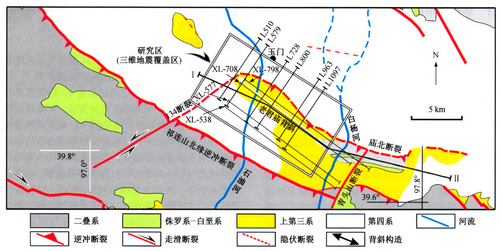
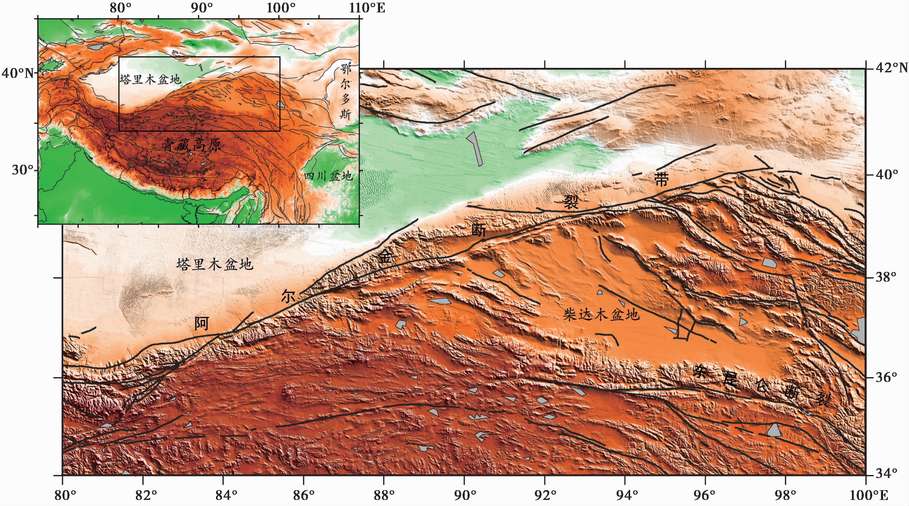
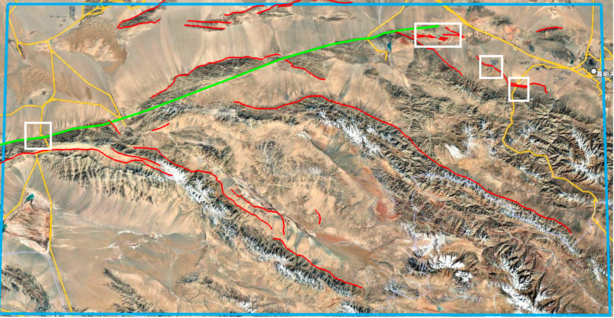

# 绪论

## 实习区区域**地质**背景

新生代印度板块与欧亚板块持续碰撞，引起青藏高原强烈的地壳缩短、增厚以及变形；青藏高原的东北缘（具体来说是甘肃-青海一带）虽然远离碰撞发生区域，但仍发生了较为强烈的韧性与脆性变形作用并且持续向东以及东北方向扩展\[1\]，其中尤为重要的是阿尔金走滑断裂和祁连山逆冲构造系统（如[图 1-1](#_Ref320879677)）。前者是一个大型的左旋走滑断裂带，即断裂两侧相对主要以水平错动为主，后者则是主要以逆冲推覆为主，地壳在此处发生一系列的褶皱变形、缩短增厚和隆升。

<figure>

<figcaption>
图 1-1青藏高原及邻区地形与主要活动断裂分布图[1]
</figcaption>
</figure>

### 北祁连山-酒西盆地逆冲-褶皱构造系统

北祁连山是青藏高原东北缘的重要活动变形前锋，也是青藏高原的东北边界，其西段与阿尔金走滑断裂相接，其北侧为河西走廊西部的酒泉盆地。北祁连山与酒泉盆地之间形成显著的盆山地形反差，山前发育一系列总体呈NWW向展布的新生代逆冲断裂和褶皱，构成北祁连山前冲断系统。晚新生代以来，逆冲变形逐渐影响酒西盆地内部，使新生代地层卷入褶皱—冲断作用，并形成老君庙、石油沟、石油河等构造带\[2\]（如[图 1-2](#_Ref321619185)）。

沉积学、磁性地层和低温热年代学研究表明，北祁连山晚中新世以来经历明显的构造隆升和剥露，但不同方法对具体隆升的启动时间的约束存在一定差异，例如约10 Ma的快速冷却记录\[3\]以及约8-6.6 Ma以来的明显盆地沉积响应\[4\]均有被报道。

<figure>

<figcaption>
图 1-2 酒西盆地老君庙构造带地质简图[2]
</figcaption>
</figure>

### 阿尔金断裂左旋走滑构造系统

阿尔金断裂是青藏高原北缘最重要的大型左旋走滑断裂之一（如[图 1-3](#_Ref322274658)），现有地质和大地测量结果表明，阿尔金断裂滑动速率具有显著的沿走向空间变化：其中中西段总体约为10±3 mm/a，自约93°E向东逐渐衰减\[5\]。其中，阿尔金断裂的走滑速率在空间上的分布并非均匀的，整体而言向东呈现递减趋势，指示着部分走滑运动可能通过邻近逆冲断裂、褶皱或者分支断裂被重新分配\[6\]。实习中我们也根据阿克塞处河流阶地以及红柳峡中央断裂的的错移对走滑速率分别进行了计算。

<figure>

<figcaption>
图 1-3 阿尔金断裂及其周边构造环境[5]
</figcaption>
</figure>

## 地质实习的科学问题与研究思路

这次实习的核心问题很明确：青藏高原东北缘是怎么一步步往北长的？本文试图从两个角度入手——浅表看走滑和逆冲怎么搭配变形，深部看地壳结构支持哪种增厚模式，然后把两头的证据拼起来，结合野外研究与地物实验，从时间空间、浅地表以及深部地壳等多层面对其进行综合解释。

在时间演化方面，本文尝试研究走滑和逆冲的时间顺序：阿尔金断裂的左旋走滑与北祁连山逆冲-缩短作用之间是否存在明确的先后关系？二者之间是否会有一者引起另一者的因果关系？阿尔金走滑过程中可伴生逆冲变形，且祁连山北缘逆冲体系在后期又可能经历重新活化，二者关系可能远比简单的“先走滑、后逆冲”或者“先逆冲、后走滑”更复杂。

在空间关系上，观察到阿尔金断裂的走滑速率自西向东逐渐“减速”，而祁连山北缘的逆冲缩短却广泛发育。那么两者之间是否存在“此消彼长”的关系？故本次实习选取阿克塞段和红柳峡中央断裂，通过阶地错移量与定年估算走滑速率；同时结合老君庙背斜的几何恢复来量化地壳缩短，试图验证走滑“衰减”是否确实转化为逆冲“增强”。

地表响应方面，逆冲缩短不仅造成地层褶皱，更是驱动了山体隆升和水系重塑。我们重点分析了老君庙背斜的构造几何，并利用石油河阶地的河拔高度与年龄数据，试图厘清河流下切是对构造隆升的被动响应，还是存在气候等其他干扰因素。

深部地壳方面，祁连山下的岩石圈缩短，到底是均匀的纯剪切增厚，还是沿大型滑脱面的简单剪切俯冲，抑或者是二者复杂耦合？因此，为此，本次实习进一步引入地球物理实验：通过密集台阵远震接收函数、CCP成像及H–κ叠加分析地壳厚度和Moho结构的空间变化，为祁连山深部变形模式提供约束，尝试在浅表变形与深部结构之间建立有机关联。同时通过典型大型走滑断裂带的MT二维反演实验，认识走滑断裂深部电性结构及其地球物理响应，为理解大型走滑构造的深部特征提供补充。

最终，本次实习尝试将阿尔金断裂的走滑变形、祁连山北缘的逆冲缩短与隆升、红柳峡记录的走滑—逆冲构造关系以及地球物理实验揭示的深部地壳结构综合起来，从浅表到深部、从局部构造到区域尺度，讨论青藏高原东北缘的应变分配方式及其向北方向生长的构造机制。

## 实习内容介绍

为了探究青藏高原东北缘是如何持续向北扩展的问题，本次实习综合运用构造地质学与地球物理学方法，开展了系统的室内与野外实践工作。室内工作主要是遥感图像解译、专题讲座学习，以及地球物理地震数据处理相关的环境配置、代码脚本运行与软件操作。野外实地踏勘共计6天，研究区域从东到西依次为祁连山北缘、老君庙背斜（石油河阶地）、红柳峡、阿克塞南侧（阿尔金走滑断裂东段），如[图 1-4](#_Ref322829289)。

野外具体开展的工作内容包括：对阿尔金断裂阿克塞段和红柳峡中央断裂附近的段家沙河流阶地开展解译，通过阶地错移量与年代数据估算左旋走滑速率；通过老君庙背斜构造几何恢复估算北祁连山北缘的地壳缩短量，并利用石油河阶地河拔高度及年龄资料分析河流下切和隆升响应；在红柳峡开展地层、断层、褶皱等地质现象的野外观察、区域地质填图及图切地质剖面的编制；并且在以上工作的基础上，结合北祁连山—酒泉盆地相关的深部地球物理资料，从浅部构造与岩石圈尺度结构等层次综合认识青藏高原东北缘的变形特征。野外工作共采集产状数据34组（涵盖地层层面与断层面），系统观测并记录地质点位27处（包括岩性点、构造点、地貌点及界线点），同时手绘与电脑绘制素描图、剖面图等图件若干幅。

<figure>

<figcaption>
图 1-4 实习主要野外踏勘区域
</figcaption>
</figure>

（其中不同的线是构造活动断裂的遥感解译结果，绿色线为阿尔金走滑断裂，红色线则为根据地势高差、地貌、三角面等其他证据推测的断层；白色框为野外实习主要研究区域）

