**地球物理环境/软件/脚本配置**

下载anaconda

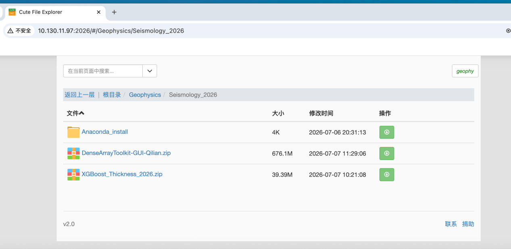

进入网址，下面是账号密码（应该是属于内部资料所以密码作打码处理）

下载压缩包DenseArray……zip和XGBzip

**matlab部分**

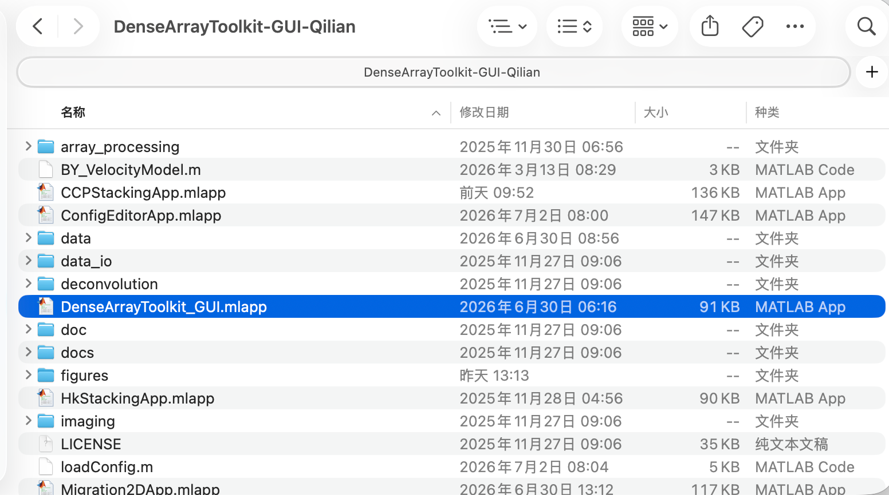

点击mlapp文件

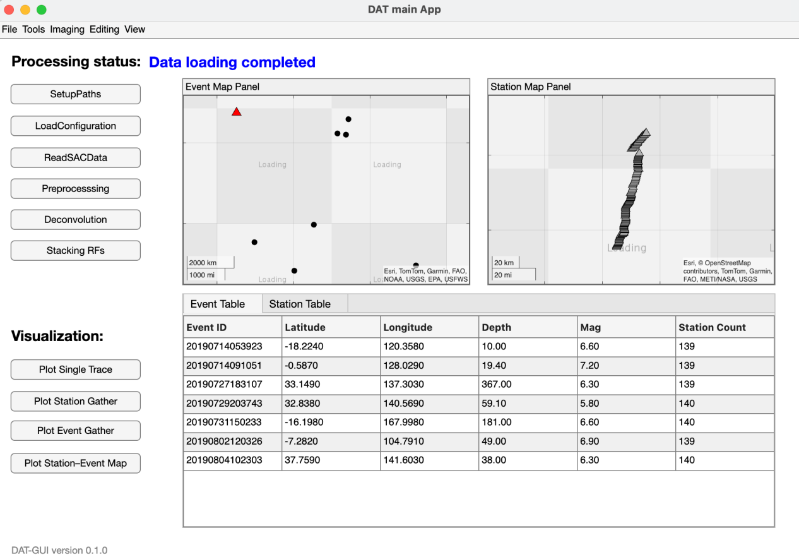

依次点击setuppaths，loadconfiguration，readSACdata,

【按钮简介】

一般按顺序点

SetupPaths-设置数据路径

↓

LoadConfiguration加载配置文件

↓

ReadSACData读取 SAC 地震波形数据

↓

Preprocessing预处理波形数据

↓

Deconvolution反褶积，计算接收函数

↓

Stacking RFs叠加接收函数

↓

Plot Single Trace画单条波形或单条接收函数

/ Plot Station Gather画台站集合图

/ Plot Event Gather画事件集合图

/ Plot Station–Event Map画台站—事件分布图

processing里面更改下拉框可以显示

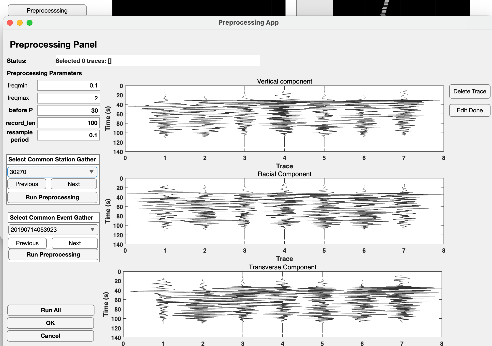

**python部分**

下载完anaconda检查一下

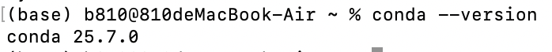

有版本号的输出即为下载成功

把刚刚下载的文件夹拖进命令行，就会自动填充路径

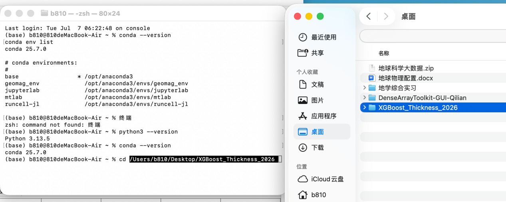

回车，进入该路径

mac的话输入ls查看文件夹内容；windows输入dir查看

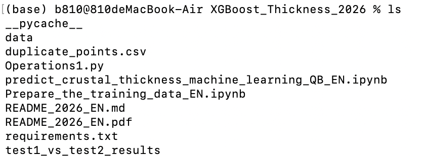

打开readme，可以看操作

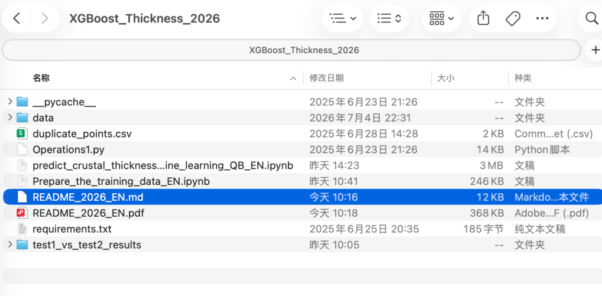

把文件中这句话“conda create --name xgboost_thickness python=3.10”

复制到命令行，回车执行

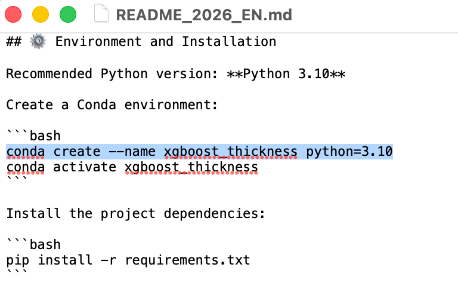

执行过程中会出现询问是否继续“Proceed( \[y\] / n )?”

输入y并且回车，表示yes继续执行

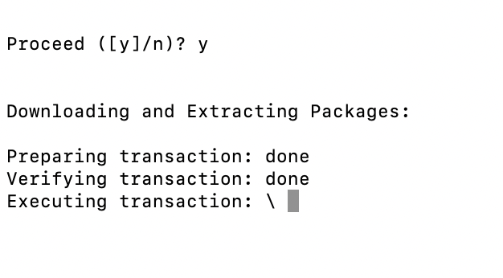

出现下面的表示环境已经配置完成

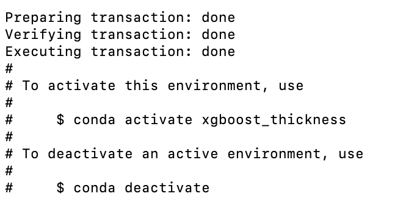

用前面readme.md文件中的“conda activate xgboost_thickness”激活环境

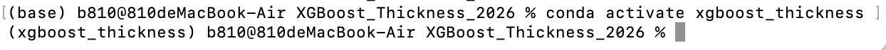

然后安装一些需要的库/包，用指令“pip install -r requirements.txt”

（tip：激活环境成功命令行前面是（xgboost_thickness）而不再是base）

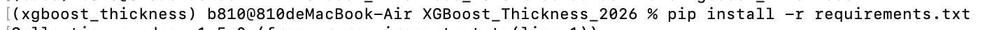

命令行中输入jupyter notebook如果没有可能是没有安装（下图自检了版本未输出说明还没安装）需要“pip install jupyter”或者“conda jupyter”

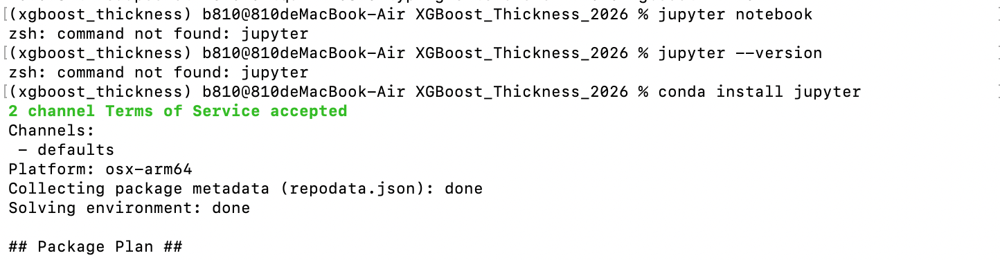

安装好jupyter notebook后命令行再输入“jupyter notebook”，可以跳转到以下页面

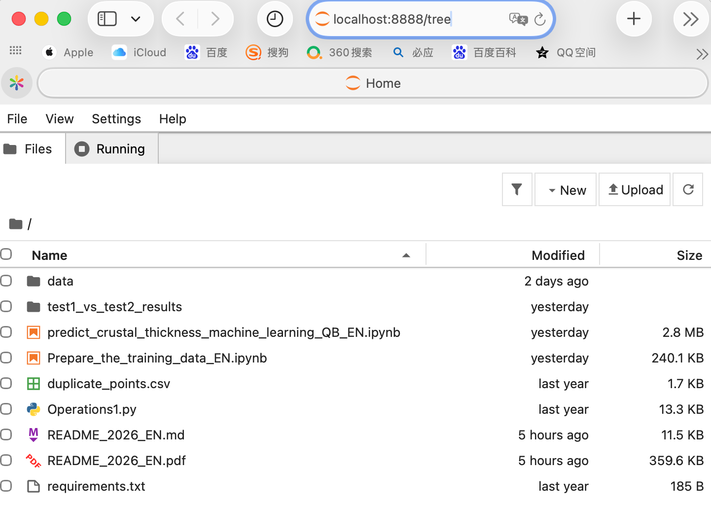

实习课主要用这两个

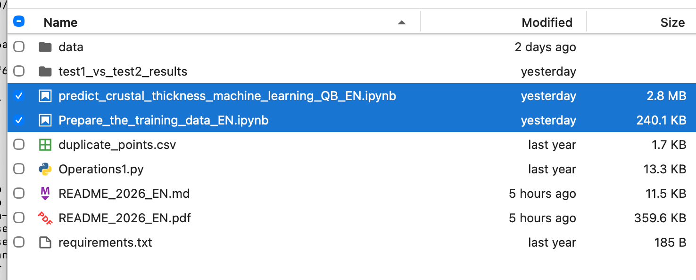

点入某一个ipynb然后Run-Run All Cell运行

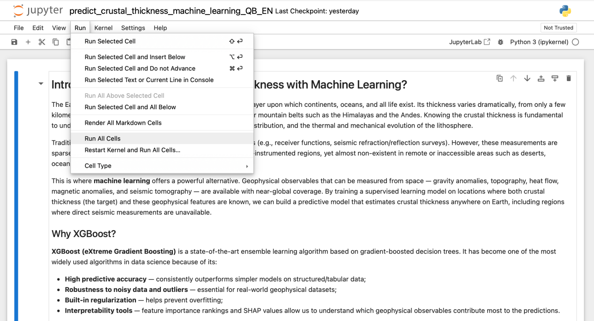

运行完没报错说明环境都配置成功了，例如下图一直运行完了最后一个cell

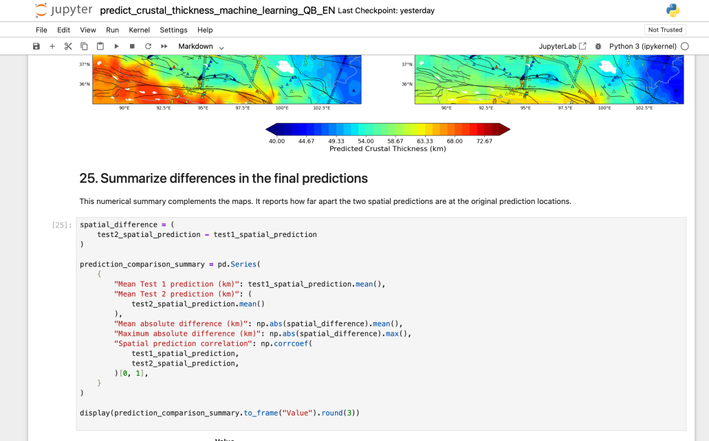

下次再要进入只需激活“conda activate xgboost_thickness”

进入“jupyter notebook”

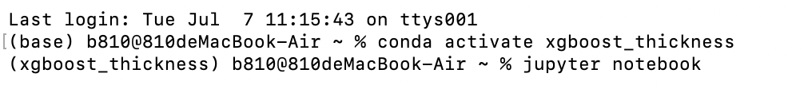
