# 1典型走滑断裂带大地电磁二维反演与电性结构分析

## 实验目的与原理

本实验以圣安德烈斯断裂（SAF，San Andreas Fault）和阿尔金断裂（ATF，Altyn Tagh Fault）两条典型大型走滑断裂为对象，通过二维大地电磁反演获得断裂带地下电阻率结构，并结合已有研究对高、低阻异常及其构造意义进行分析。并且通过调整反演参数、比较不同反演模式和测点处理方案，认识二维 MT 反演方法及其结果的不确定性，并进一步理解大型走滑断裂的深部结构特征。

大地电磁法（MT，Magnetotelluric Method）利用天然变化电磁场探测地下电性结构。不同频率的电磁信号具有不同的探测深度，其中高频主要反映浅部结构，低频能够探测更深部介质。通过地表观测得到的电磁响应进行反演，可以将不同频率下的响应转换为地下电阻率随位置和深度的分布。本实验采用二维 MT 反演，在兼顾观测数据拟合程度和模型平滑性的基础上获得电阻率模型，并据此识别断裂带附近的主要电性异常。

## 数据处理与二维反演方法

（1）运行环境与基础配置

本实验采用已完成常规处理的 MT 测深 EDI 数据作为输入，基于 Docker Desktop 容器化平台（版本 v29.6.1），拉取 GeoEm 地理模拟镜像作为运行环境，并通过映射端口在本地 Jupyter Notebook（v7.5.6，Python 3.10.20 内核）中利用 Python 环境下的 MTpy 软件包进行数据读取、质量检查和可视化分析，并采用 Occam2D 方法开展二维电阻率反演。

（2）二维反演过程

本次二维反演实验采用 Occam2D 方法开展。为比较不同数据模式对二维电性结构反演结果的影响，本实验分别进行了不同模式的反演。由于各模式的基本处理流程相同，本文以ATF中拟合效果较好的 TM 模式反演为例介绍具体反演过程。

首先对测线上的 MT 数据进行预处理。本次共采用 21 个测站的数据，站点分布如[图 5-1](#_Ref329585703)。反演前对阻抗张量进行旋转，使其与区域地电走向及剖面方向相匹配。其中，区域电性走向角设置为 87°，剖面方向角设置为 177°，二者相差约 90°，表明剖面方向基本垂直于区域电性走向，符合二维 MT 反演中测线尽量垂直于主要电性走向的基本要求。

<figure>
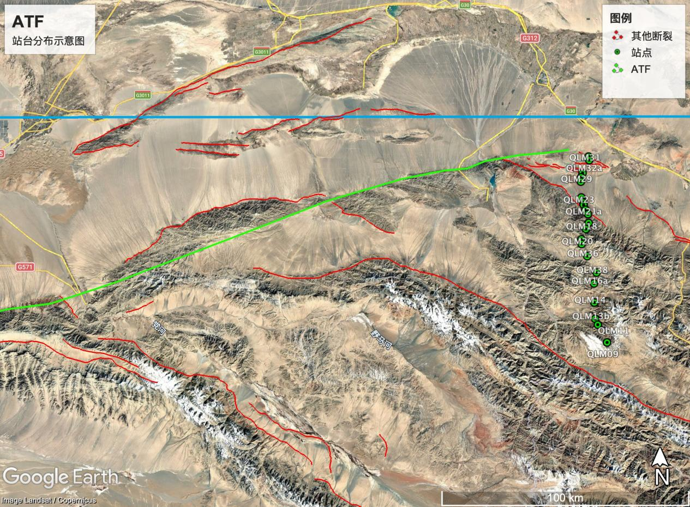
<figcaption>
图 5-1 阿尔金断裂台站分布
</figcaption>
</figure>

反演数据选取 20 个对数等间隔频点，频率范围为 0.001-17.38 Hz，对应周期约为 1000-0.058 s。不同频率的电磁场具有不同的探测深度，高频数据主要反映较浅部的电性结构，而低频数据对深部结构更加敏感，因此该频率范围能够同时对浅部及中深部电性结构提供约束。

本次采用 TM 单模式反演（TM_only，model mode = 6），即仅使用 TM 模式的视电阻率和相位数据参与反演，不加入 TE 模式及 Tipper 数据。数据误差方面，TM 视电阻率误差设置为 10%，相位误差设置为 5%。在 Occam2D 反演中，误差大小决定相应数据在目标函数中的权重，误差越小，相应数据所占权重越大。该误差设置能够在保证主要观测特征得到拟合的同时，避免反演模型过度追随局部噪声。

模型离散方面，水平方向基本网格宽度设置为 600 m，垂向设置 40 层，第一层厚度为 20 m；目标解释深度设置为 100 km，深部边界参数设置为 200 km，同时在测线两端设置逐渐加宽的扩展网格，以减小模型边界对研究区内部反演结果的影响。最终用于反演的模型包含 1709 个自由参数。这种网格设置使浅部具有相对较高的空间分辨率，并为中深部结构提供足够的模型空间。

反演采用均一半空间作为初始模型，初始电阻率设置为 100 Ω·m（见[表 5-1](#_Ref353821397)），即 log10ρ=2.0。最大迭代次数设置为 30 次，目标 RMS 拟合差设为 1.2。初始模型的 RMS misfit 约为 6.49，随着迭代进行，观测数据与模型响应之间的失配逐渐降低。最终反演进行至第 14 次迭代，RMS misfit 降至 1.306，模型粗糙度为 194.48，步长为 2.38×10⁻²。此时 RMS 已非常接近预设目标值 1.2，相比初始模型显著降低，说明 TM 数据与二维模型之间获得了较好的拟合。程序同时提示拟合差可能已经接近当前参数设置下能够达到的最低水平，因此最终采用第 14 次迭代模型作为 TM 模式的反演结果。

| 类别             | 本次设置                 |
|:-----------------|--------------------------|
| 测站数           | 21                       |
| 反演模式         | TM 单模式反演（TM_only） |
| 频点数           | 20                       |
| 频率范围         | 0.001–17.38 Hz           |
| 地电走向角       | 87°                      |
| 剖面方向角       | 177°                     |
| TM视电阻率误差   | 10%                      |
| TM相位误差       | 5%                       |
| 初始模型         | 100 Ω·m 均匀半空间       |
| 水平基本网格宽度 | 600 m                    |
| 垂向网格         | 40 层，首层厚度 20 m     |
| 目标解释深度     | 100 km                   |

表 5-1 TM 模式二维反演主要参数及结果

2.  过程图件分析

    下面以ATF的TM反演模式为例进行分析。首先读取EDI格式的MT观测数据，并对单个测点的视电阻率和阻抗相位曲线进行检查。以QLM22c测点为例，其不同阻抗分量的视电阻率和相位随周期变化总体连续（如[图 5-2](#_Ref330173948)），可据此初步了解数据随频率的变化特征，并检查数据质量，为后续剖面分析和二维反演提供基础。李满等（2020）在阿尔金断裂昌马段 MT 数据处理中，利用 RhoPlus 检验视电阻率和相位曲线的合理性，并对近场效应、“飞点”及部分异常相位数据进行了筛除\[10\]。参考这一思想，本实验后续进一步通过剔除可疑测点并重复反演，检验异常数据对最终模型的影响。

    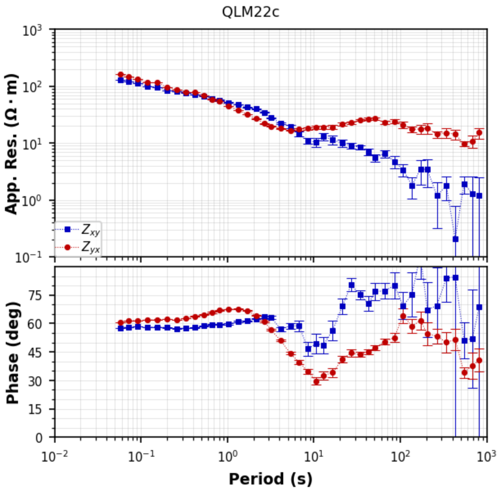

    图 5-2 QLM22c测点视电阻率与阻抗相位曲线

    在单测点数据检查的基础上，将全部21个MT测点沿剖面排列，绘制视电阻率和阻抗相位拟断面（如[图 5-3](#_Ref330476474)）。拟断面能够直观反映电磁响应在测线方向及不同周期范围内的变化，为识别剖面电性结构的横向差异和确定后续反演参数提供参考。图中不同测点和周期范围的视电阻率与相位存在明显变化，表明测线下方电性结构具有一定的空间非均一性。

    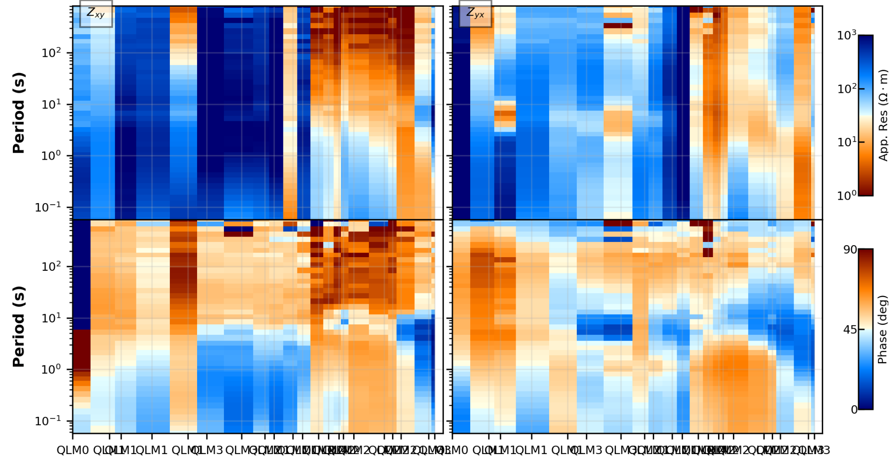

    图 5-3阿尔金断裂MT测线视电阻率与阻抗相位拟断面

    为进一步分析测区电性结构的维性特征，对各测点计算相位张量并绘制相位张量-感应箭头拟断面（如[图 5-4](#_Ref331669771)）。相位张量具有对常见电场静态畸变不敏感的特点，可用于分析区域电性结构的维性和主方向，其椭圆的形态和偏斜角（skew angle）可以反映地下电性结构的二维或三维特征\[11-12\]。实验中以偏斜角作为辅助判断依据，较大的偏斜角（大于约3°）表明局部可能存在较明显的三维效应，可以作为存在三维效应的参考指标。

    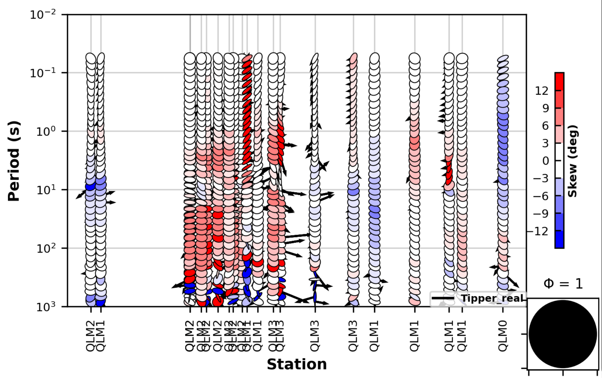

    图 5-4 MT测线相位张量与感应箭头拟断面

二维反演要求将实际分布的MT测点投影至统一剖面线上。本实验根据测点空间分布设置剖面方位角（profile_angle）为177°，并将测点投影到二维剖面，同时将阻抗数据旋转至相应的大地电构造坐标系，其中设定大地电走向（geoelectric_strike）为87°。投影后的测点位置（如[图 5-5](#_Ref332291630)）作为Occam2D反演中的水平位置输入。

<figure>
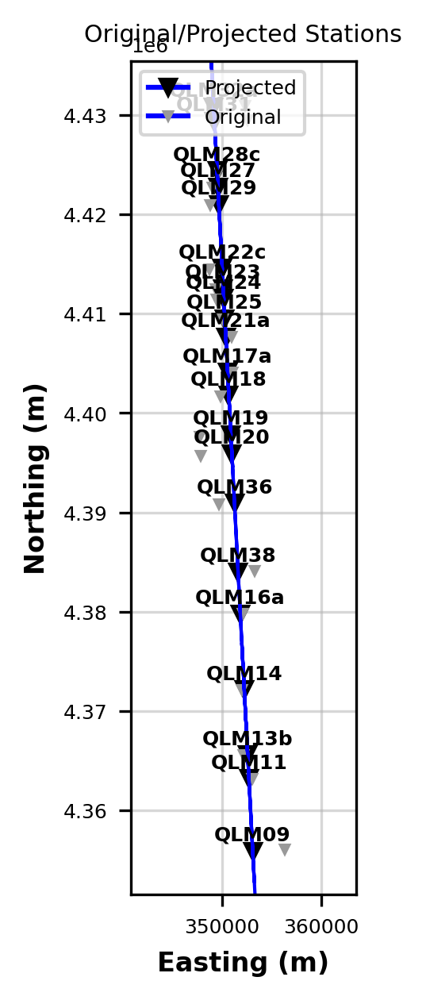
<figcaption>
图 5-5 MT测点原始位置与二维剖面投影位置
</figcaption>
</figure>

在完成数据旋转和测点投影后，采用Occam2D建立二维反演模型网格（如[图 5-6](#_Ref332577349)）。模型水平方向以MT测点覆盖范围为核心区域，并在剖面两端设置逐渐增大的扩展网格，以减小模型边界对反演结果的影响；垂向网格由浅至深逐渐加粗。实验设置垂向层数为40层，首层厚度为20 m，水平基本网格宽度为600 m，并将模型底界延伸至200 km，以满足不同周期MT数据的反演需求。

<figure>
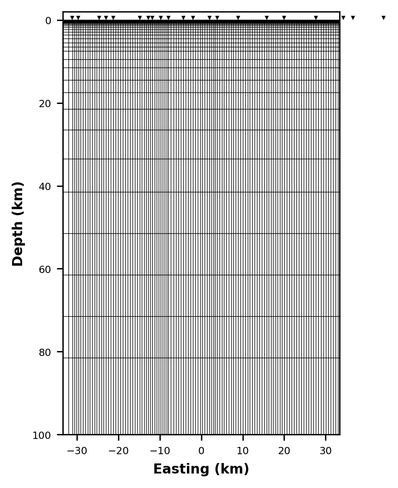
<figcaption>
图 5-6阿尔金断裂MT剖面Occam2D反演网格
</figcaption>
</figure>

在完成以上全部过程之后，就可以得到最终的TM单模式下的二维电阻率反演模型，具体结果可见[图 5-8](#_Ref333938716) 的子图（b）

## ATF实验设计与结果

（1）测点筛选对比实验

参考前人阿尔金断裂二维 MT 研究所做的测点敏感性检验，例如Xiao et al.（2015）通过剔除存在异常响应的测点重新反演，并比较剔除前后的模型变化，以判断主要电性结构的稳定性\[13\]；本实验也设置了类似的对比。

对于原始demo脚本，采用的是TETM联合反演，为检验局部异常测点对二维反演结果的影响，本实验分别采用全部测点和剔除异常测点后的数据进行反演（本案例中即指不让数据质量较差的站点QLM17a参加反演，并非真的删除了该站点数据）。从实验结果的数值来看，剔除 QLM17a 后 RMS 从 5.95 降到了 4.70，数据拟合有所改善；但 Roughness 从 164 增加到 213，模型反而更粗糙一些（见[表 5-2](#_Ref354644940)）；实验前本预期的是剔除质量较差的数据模型能够整体变好（RMS以及粗糙度都降低），实际结果说明数据拟合改善并不意味着模型更加平滑。 而且从两张电阻率剖面看（如[图 5-7](#_Ref332795840)），二者总体的大尺度结构其实相当一致：西部相对低阻、中东部深部高阻以及若干浅部低阻异常的位置基本都还在，说明 QLM17a 并没有从根本上控制整个反演模型。

倘若换个角度，单从高阻与低阻分布来看，不难发现浅部地表靠近横坐标为0处有一个明显的低阻体以近乎水平的低角度从地下延伸至地表，推测该处可能受阿尔金走滑影响；并且图上横坐标靠近0的一侧深部地壳有明显低阻，而横坐标数字更高处的深部为高阻，并且联系图5-1台站分布可见低阻侧即测线的北侧（更加靠近阿尔金断裂一侧），这种分布与Xiao et al. (2011, 2017) 研究相一致——阿尔金断裂带通常表现为高、低阻异常之间的近直立电性边界，其两侧可发育深部高阻块体和局部低阻剪切带\[14-15\]。说明本次实验的电阻率模型能够有效反映阿尔金断裂东端的深部电性结构，指示了南侧祁连山内部电性结构更加复杂，同时也为其阿尔金南侧的边界范围提供了一定的深部地球物理约束。

<figure>
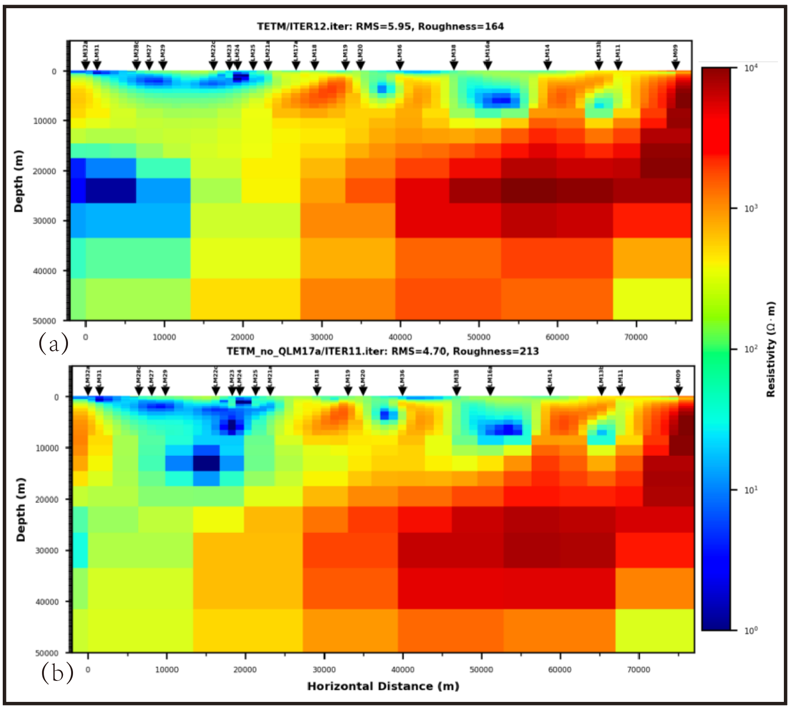
<figcaption>
图 5-7 ATF剔除 QLM17a 测点前后二维 MT 反演电阻率模型对比
</figcaption>
</figure>

图中（a）全部测点参与反演的 TE+TM 联合反演结果；（b）剔除 QLM17a 测点后的 TE+TM 联合反演结果。两组模型采用统一电阻率色标及横纵坐标，用于比较 QLM17a 测点对二维反演电性结构及数据拟合的影响。

| 反演方案       | 迭代次数 | RMS拟合差 | 目标拟合差 | 粗糙度  | 步长     |
|----------------|----------|-----------|------------|---------|----------|
| TETM           | 12       | 5.953     | 1.200      | 164.224 | 0.002973 |
| TETM_no_QLM17a | 11       | 4.701     | 1.200      | 212.623 | 0.003797 |

表 5-2 剔除异常测点前后的反演参数对比

（2）不同数据模式联合反演对比实验

本实验进一步对比了不同反演模式的运行结果（如[图 5-8](#_Ref333938716)）。实验发现TE 单模式反演的 RMS 和模型粗糙度（见[表 5-3](#_Ref355670167)）均较高，其深部高阻结构可靠性相对较低；TM 单模式反演虽获得最低 RMS，但其深部呈大范围低阻特征，与其他模式差异明显，说明不能仅依据拟合误差选择模型。李满等（2020）亦指出其二维反演中 TM 数据整体拟合优于 TE 数据，这种差异反映了 TE 与 TM 模式对地下电性结构及非二维效应具有不同敏感性\[10\]。

在断裂带的二维 MT 研究中，同时利用 TE、TM 及垂直磁场传递函数进行联合反演是一种常见的多数据约束方式。Unsworth and Bedrosian（2004）在 San Andreas Fault 研究中同时反演 TE、TM 及垂直磁场传递函数，并通过多组反演检验不同数据类型之间的一致性\[16\]。 因此，本实验进一步比较了单一 TE、单一 TM、TE+TM 及加入 Tipper 后的联合反演结果。联合 TE、TM 及 PT 数据后，模型在数据拟合与结构复杂度之间取得了较好平衡。不同反演结果在剖面约 10–20 km、50–55 km 及 65–70 km 处均显示较稳定的浅部低阻异常，表明这些异常的横向位置具有较高可信度；但不同模式对中深部绝对电阻率的约束差异较大，因此深部结构的地质解释仍具较大不确定性。总体而言，多模式联合反演结果更适合作后续解释的主要依据。

需要指出的是，前文虽以 RMS 最低的 TM 单模式反演为例，但 RMS 衡量的仅仅只是观测数据与理论响应的平均误差，最低 RMS 并非最优模型的充分条件。Unsworth and Bedrosian（2004）通过约束反演和合成数据试验指出，不同结构模型可能获得统计上可接受的拟合，因此模型可靠性需要结合敏感性试验和结构稳定性共同判断\[16\]。换言之，评估二维 MT 反演需要在数据拟合与模型平滑之间进行权衡，例如 Xiao et al.（2015）就通过改变正则化参数构建 RMS 与 Roughness 的 L 曲线，并依据折衷关系选择模型\[13\]。基于此，本实验除 RMS 外，同时引入 Roughness 等多指标综合评价不同反演方案的优劣。

<figure>
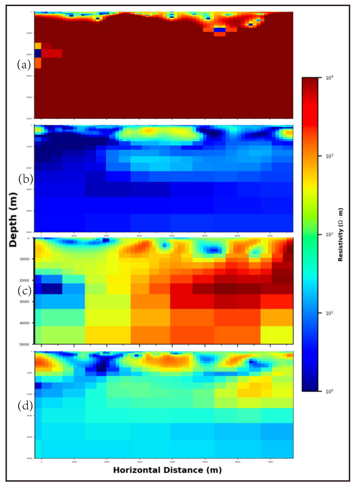
<figcaption>
图 5-8 ATF不同反演模式下二维 MT 电阻率模型对比
</figcaption>
</figure>

1.  为 TE 模式反演结果，（b）为 TM 模式反演结果，（c）为 TE+TM 联合反演结果，（d）为 TE+TM+TP/TIPPER 联合反演结果。各子图采用统一电阻率色标及横纵坐标，以比较不同数据模式对地下电性结构成像结果的影响。

| 反演模式 | 迭代次数 | RMS拟合差 | 目标拟合差 | 粗糙度  |   步长   |
|----------|:--------:|:---------:|:----------:|:-------:|:--------:|
| TE_only  |    30    |   7.441   |   1.200    | 696.712 | 0.09632  |
| TM_only  |    14    |   1.306   |   1.200    | 194.480 | 0.02385  |
| TETMTP   |    17    |   3.509   |   1.200    | 255.098 | 0.003214 |
| TETM     |    12    |   5.953   |   1.200    | 164.224 | 0.002973 |

表 5-3 不同极化模式反演参数与拟合结果对比

## SAF实验设计与结果

与ATF的二维MT反演一样，本次 SAF 剖面（数据如[图 5-9](#_Ref401620505)）二维 MT 反演也是在 Jupyter Notebook 环境下完成，运行内核为 Python 3.10.20。数据处理和反演输入文件生成主要依赖 MTpy，二维反演计算由 Occam2D 程序完成。输入数据为 ./edi 文件夹中的 SAF 剖面 EDI 文件。

<figure>
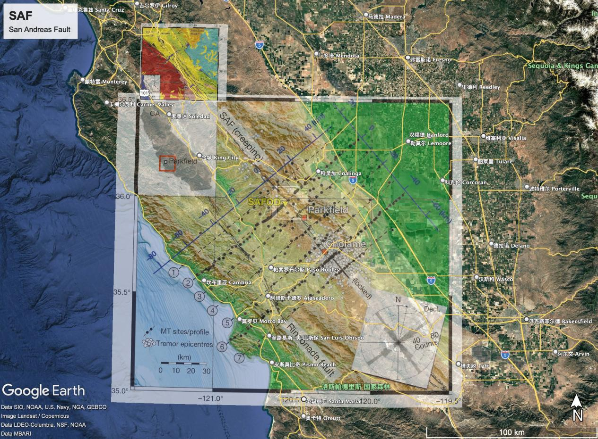
<figcaption>
图 5-9 圣安德烈斯断裂台站分布
</figcaption>
</figure>

（1）反演参数与测点筛选对比实验

本次实验的视电阻率误差设置为 10%，相位误差设置为 5%。频率设置包括两组方案：基础方案采用 np.logspace(-3.436, 2.10, 14)，频率范围约为 0.00037–125.9 Hz；New 方案采用 np.logspace(-3.0, 2.10, 21)，频率范围约为 0.001–125.9 Hz，剔除了低于 0.001 Hz 的极低频数据并增加了频率采样数量。

反演参数的设置会直接影响模型的收敛过程及模型平滑程度，因此有必要通过多组参数试验选择相对合适的方案。已有二维 MT 研究通常通过改变正则化参数，考察 RMS 与模型粗糙度之间的权衡关系以选择最终模型\[10,13\]。 本实验据此对基础方案和 New 方案进行了对比。

基础方案使用 40 个垂向层、500 m 水平网格宽度、200 km 模型底界和 100 km 目标深度；New 方案使用 60 个垂向层、400 m 水平网格宽度、150 km 模型底界和 80 km 目标深度，网格更精细，更有利于约束浅—中地壳结构。反演初始模型为均匀 100 Ω·m 半空间，最大迭代次数为 30 次，目标拟合差为 1.2。总体上，该参数设置兼顾了数据拟合、模型平滑性和 SAF 剖面中上地壳电性结构的分辨能力。

对比不同参数设置及测点筛选条件下的 SAF 剖面二维 MT 反演结果（如[图 5-10](#_Ref334997557)）后可以发现采用 New 频率和网格参数后，RMS 拟合差和模型粗糙度均有所降低，表明增加有效频率采样并适当细化模型网格能够改善反演效果。

数据筛选是提高 MT 反演可靠性的重要环节。例如 Share et al.（2023）在 San Andreas Fault 的 MT 二维成像中，根据阻抗和 Tipper 数据质量检查剔除了异常数据后再进行二维反演\[17\]。 本实验通过剔除 mvx030 和 mvx031 后重新反演，以测试可疑测点对 SAF 电性结构模型的影响。可以发现进一步剔除这两个测点后，RMS 继续下降，其中 New 方案最终 RMS 为 3.2793，模型粗糙度为 101.1153（见[表 5-4](#_Ref356644973)），为四组方案中最低（为了展示效果，未将剔除站点的NEW方案放入对比图中）。说明 mvx030 和 mvx031 可能包含较明显的数据异常或局部三维效应，其参与反演会在一定程度上降低二维反演的整体拟合质量。需要指出的是，各方案最终 RMS 均高于设定的目标拟合差 1.2，因此反演尚未达到目标 RMS，最终模型仍应结合响应拟合情况和电性结构的地质合理性进行综合评价。

<figure>
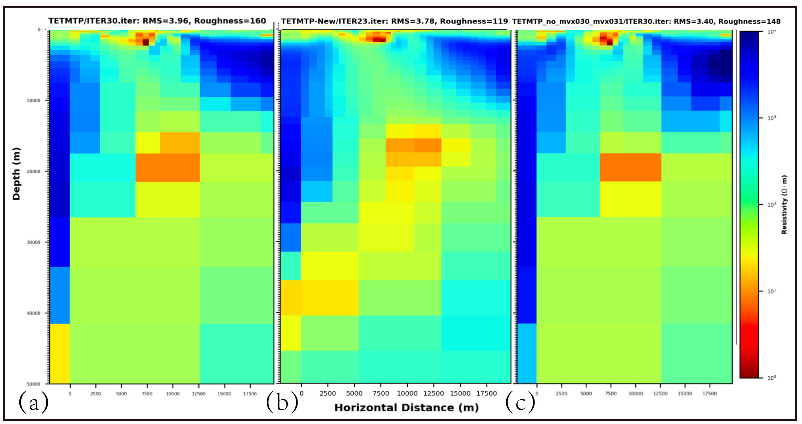
<figcaption>
图 5-10 SAF剖面不同参数配置及测点筛选条件下的二维MT反演电阻率模型对比
</figcaption>
</figure>

（a）基础参数方案，全部测点参与反演；（b）New参数方案，全部测点参与反演；（c）基础参数方案，剔除 mvx030 和 mvx031 后的反演结果。各模型采用统一电阻率色标及横纵坐标，用于比较参数设置及异常测点筛选对二维电性结构反演结果的影响。

| 反演方案 | 测点设置 | 最终迭代次数 | RMS Misfit | Target | Roughness | Step Size |
|----|----|----|----|----|----|----|
| 基础方案 | 全部测点 | 30 | 3.9621 | 1.2000 | 160.4753 | 3.6313×10⁻² |
| New方案 | 全部测点 | 23 | 3.7768 | 1.2000 | 118.8859 | 2.5745×10⁻² |
| 基础方案 | 剔除 mvx030、mvx031 | 30 | 3.3989 | 1.2000 | 148.2598 | 2.9337×10⁻² |
| New方案 | 剔除 mvx030、mvx031 | 23 | 3.2793 | 1.2000 | 101.1153 | 1.5588×10⁻³ |

表 5-4 SAF 的二维 MT 不同反演方案及最终反演结果对比

（2）不同数据模式联合反演对比实验

为考察不同 MT 数据模式对反演结果的影响，在 New 方案的参数设置下分别进行了 TM、TE、TE+TM 以及 TE+TM+TP/TIPPER 反演。需要说明的是TE-only 与 TE+TM+TP/TIPPER 联合反演均未达到预设目标 RMS=1.2，而是在后续迭代过程中出现 RMS 收敛困难并提前终止。最终采用程序终止前最后一个有效迭代模型进行比较，其中 TE-only 的最终有效 RMS 为 4.5719，TE+TM+TP/TIPPER 联合反演为 3.7768。

实验结果（如[图 5-11](#_Ref335552188)）表明，不同数据模式所得拟合效果与模型平滑程度存在明显差异。其中，TM-only 模式获得最低的 RMS（1.746），但模型粗糙度最高；TE+TM 联合反演的 RMS 为 3.835（见[表 5-5](#_Ref357081955)），说明增加数据类型后，由于不同模式对地下结构具有不同的敏感性和约束，整体拟合难度有所增加。

<figure>
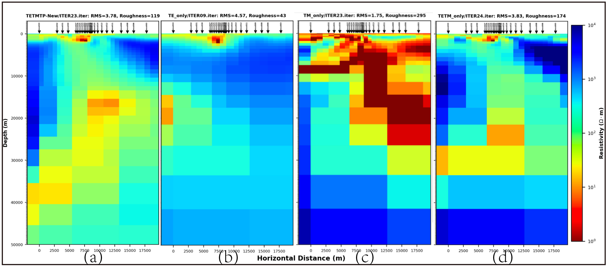
<figcaption>
图 5-11 SAF剖面 New 参数方案下不同数据模式的二维 MT 反演电阻率模型对比
</figcaption>
</figure>

（a）TE+TM+TP联合反演；（b）TE-only 反演；（c）TM-only 反演；（d）TE+TM 联合反演。各模型采用统一电阻率色标以及横纵坐标，展示不同数据模式对 SAF 剖面二维电性结构反演结果的影响。

| 反演模式 | 数据类型 | 最终迭代次数 | RMS Misfit | Target | Roughness | Step Size |
|----|----|----|----|----|----|----|
| TM_only | TM | 23 | 1.7459 | 1.2000 | 294.6617 | 3.8106×10⁻² |
| TE_only | TE | 8 | 4.5719 | 1.2000 | 43.0416 | 5.9389×10⁻³ |
| TETM_only | TE + TM | 24 | 3.8346 | 1.2000 | 174.1278 | 5.5793×10⁻³ |
| TETMTP | TE+TM+ TP/TIPPER | 23 | 3.7768 | 1.2000 | 118.8859 | 2.5749×10⁻² |

表 5-5 SAF 剖面 New 方案下不同反演模式结果对比

## 总结

本实验通过改变测点、参数及数据模式，对ATF和SAF两条剖面的MT数据进行二维反演对比，获得以下认识：

1.  异常测点的筛选会明显影响反演结果，但剔除异常并不等于模型整体变好—— ATF剖面剔除 QLM17a 后，RMS 降低而模型粗糙度增大；SAF 剖面剔除 mvx030、mvx031 后，RMS 与粗糙度均有所下降。

2.  研究区ATF地壳电性结构具有明显横向非均一性，浅部表现为大尺度高阻体与局部低阻异常相间分布，并形成显著电阻率梯度带；深部总体向南电阻增加。 去除异常测点 QLM17a 后，深部主要高阻结构以及浅部低阻结构仍基本保持，说明反演所得大尺度电性结构具有一定稳定性。综合来看，实验结果支持阿尔金断裂带是不同电性与流变性质地壳单元之间的重要构造边界；而祁连山的地壳电性结构呈现深部高阻以及复杂性。

（3）合理的参数优化能够提高反演效率。 SAF 剖面的 New 方案相比基础方案具有更少的迭代次数、更低的 RMS 和粗糙度，整体表现更优，说明针对具体数据调整反演参数具有必要性。

（4）不同反演模式对地下电性结构的约束存在明显差异，是影响最终模型形态的重要因素。 单独使用 TE 模式时模型粗糙度较高，而 TM 模式虽然能够取得较低的 RMS，但仅依赖单一极化模式，对 3D 效应相对不敏感，对横向电阻率突变较敏感，对电导的约束存在不足\[17\]。相比之下，TE+TM 联合反演综合利用了两种极化模式的信息，所得模型整体连续性和稳定性更好；进一步加入 TP数据后，可增加对二维电性结构的约束，但模型粗糙度也可能随之增大。由此可见，反演结果并非 RMS 越低越好，而是在数据拟合程度与模型平滑性之间存在一定权衡，应结合不同模式的敏感性及最终模型的地质合理性选择合适的反演方案。
