# 密集台阵远震接收函数处理、CCP 成像与 H–κ 叠加实验

## 实验目的与基本原理

### 实验目的

基于密集地震台阵的远震P波接收函数，本文采用H-κ叠加（即地壳厚度H和地壳平均波速比κ）和CCP成像方法（即Common Conversion Point，共转换点成像）研究台阵下方地壳结构。密集台阵因台间距小、射线覆盖密，可显著提高对速度间断面的横向分辨能力。其中，H-κ叠加约束各台站下方的地壳厚度H和平均Vp/Vs（即κ），CCP成像则揭示Moho等界面的空间展布及横向变化。两种方法互为补充，共同为祁连山的地壳增厚和深部构造变形提供地球物理约束\[18-19\]。

### 实验原理

远震 P 波以较陡的入射角到达台站下方，当其传播经过 Moho （即 Mohorovičić discontinuity ，莫霍洛维奇不连续面，简称莫霍面）等速度不连续界面时，一部分 P 波会发生 P-S 波型转换。通过对三分量远震记录进行旋转和反褶积，可在一定程度上去除震源时间函数和共同传播路径的影响，获得主要反映台站下方介质结构的接收函数。接收函数中的直达 P 波、Moho 产生的 Ps 转换波及其多次反射转换相，可以用于约束地壳速度间断面的位置和性质；迭代时域反卷积方法由 Ligorría 和 Ammon（1999）提出。该方法通过源波形与观测分量之间的互相关，在每次迭代中优先提取贡献最大的接收函数脉冲，并不断更新残差、逐步恢复较弱的转换震相，从而获得接收函数，是接收函数提取中常用的方法之一\[20\]。

H–κ 叠加利用 Moho 的 Ps、PpPs 和 PpSs+PsPs 等震相对地壳厚度 H 和平均 Vp​/Vs​ 比 κ 的不同敏感性，在给定的 H−κ 参数空间中计算各震相的理论到时，并对相应接收函数振幅进行加权叠加。叠加能量最大的参数组合被认为是台站下方较优的地壳厚度和 Vp/Vs解。由于仅利用 Ps 到时会存在较明显的 H 与 Vp/Vs权衡，联合多次波能够显著减小这种非唯一性\[18\]。

CCP 成像则侧重于获得地下结构的空间连续变化。根据参考速度模型和射线路径，将不同地震、不同台站接收函数中的 P-S 转换能量反投影到地下相应的转换位置，并对落入同一空间单元内的信号进行叠加，从而增强相干转换信号、降低随机噪声的影响，形成沿剖面的地壳结构图像\[21\]。因此，H–κ 主要提供单个台站下方的地壳厚度和 Vp/Vs约束，而 CCP 成像能够进一步显示 Moho 等界面的横向起伏；二者结合可以提高对研究区地壳结构解释的可靠性。

## 数据与处理过程及结果

### 实验数据

本实验采用课程提供的、布设于野外实习区附近的短周期密集地震台阵远震三分量波形数据（如[图 6-1](#_Ref337199274)），研究范围约为 39.3863°–40.1444°N、97.6215°–97.8821°E（如[图 6-2](#_Ref337518607)）。台阵剖面跨越祁连山北缘及河西走廊等不同构造单元，可用于研究不同构造单元之间地壳结构及 Moho 深度的横向变化。

本实验的主要任务为：利用 Dense Array Toolkit处理实习区附近密集台阵数据，获得接收函数叠加和深部成像结果，并分析不同构造边界和断裂两侧的深部结构变化。

<figure>
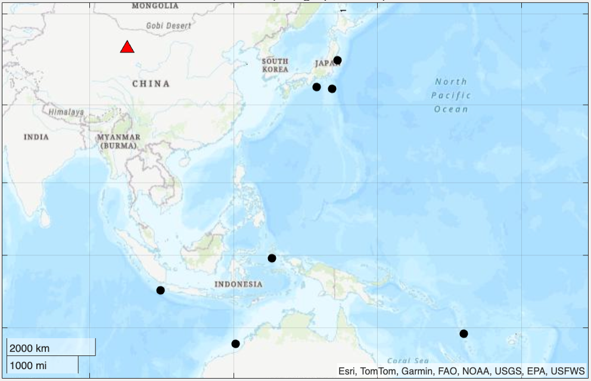
<figcaption>
图 6-1 远震事件分布
</figcaption>
</figure>

<figure>
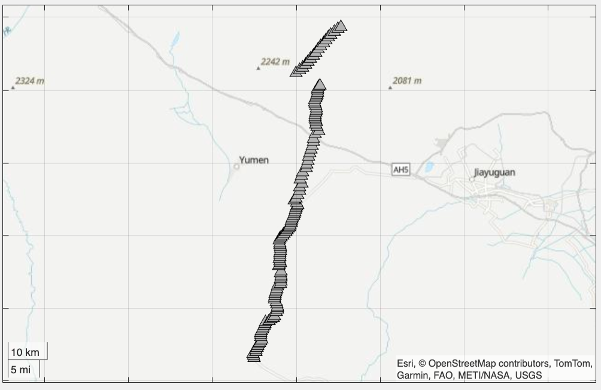
<figcaption>
图 6-2 祁连山地区密集台站分布
</figcaption>
</figure>

### 实验步骤与结果

**1. 接收函数计算与质量检查**

对远震三分量记录完成时间窗截取及坐标旋转后，获得径向（R）、横向（T）和垂向（Z）分量。垂向分量主要包含直达 P 波能量，径向分量中包含与地下速度间断面有关的 P-S 转换信息。进一步通过反褶积削弱震源时间函数及共同传播路径的影响，得到径向接收函数。图中接收函数在 0 s 附近具有明显的直达 P 波响应，其后出现多组正、负振幅转换信号。[图 6-3](#_Ref338375764)中R是径向分量 Radial；T是切向分量 Transverse；Z是垂向分量 Vertical；RF (wlr)表示 water-level deconvolution，即水准法反褶积得到的接收函数；RF (itr）表示 iterative deconvolution，即迭代反褶积得到的接收函数。

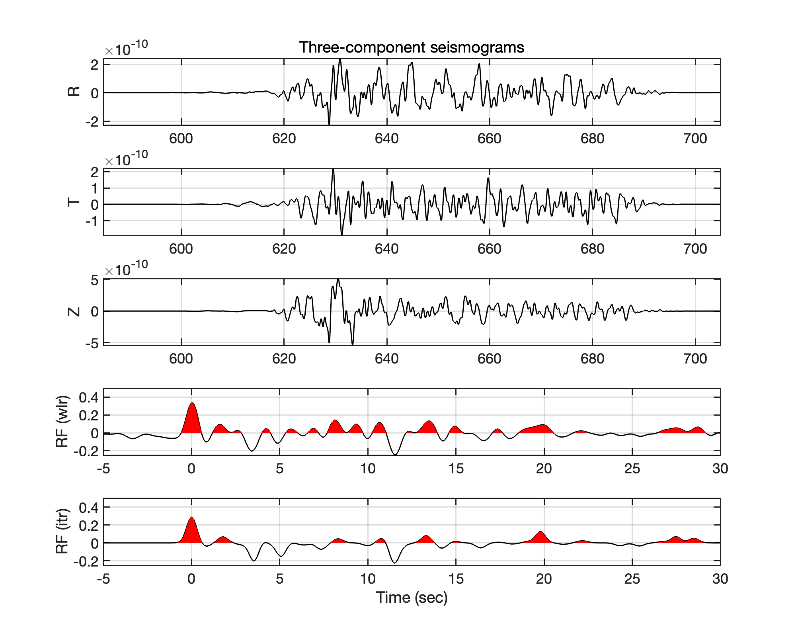

图 6-3 单条远震记录三分量波形及不同反褶积方法获得的接收函数

2\. **密集台阵接收函数特征**

实验发现不同远震事件虽然传播路径和震中距不同，但经过反褶积处理后，直达 P 波附近及部分后续转换震相具有一定一致性（如[图 6-4](#_Ref339232921)），表明接收函数有效削弱了震源差异；同时，不同震中距记录之间仍存在一定波形差异，反映了射线路径、地下横向非均一性及噪声的共同影响。

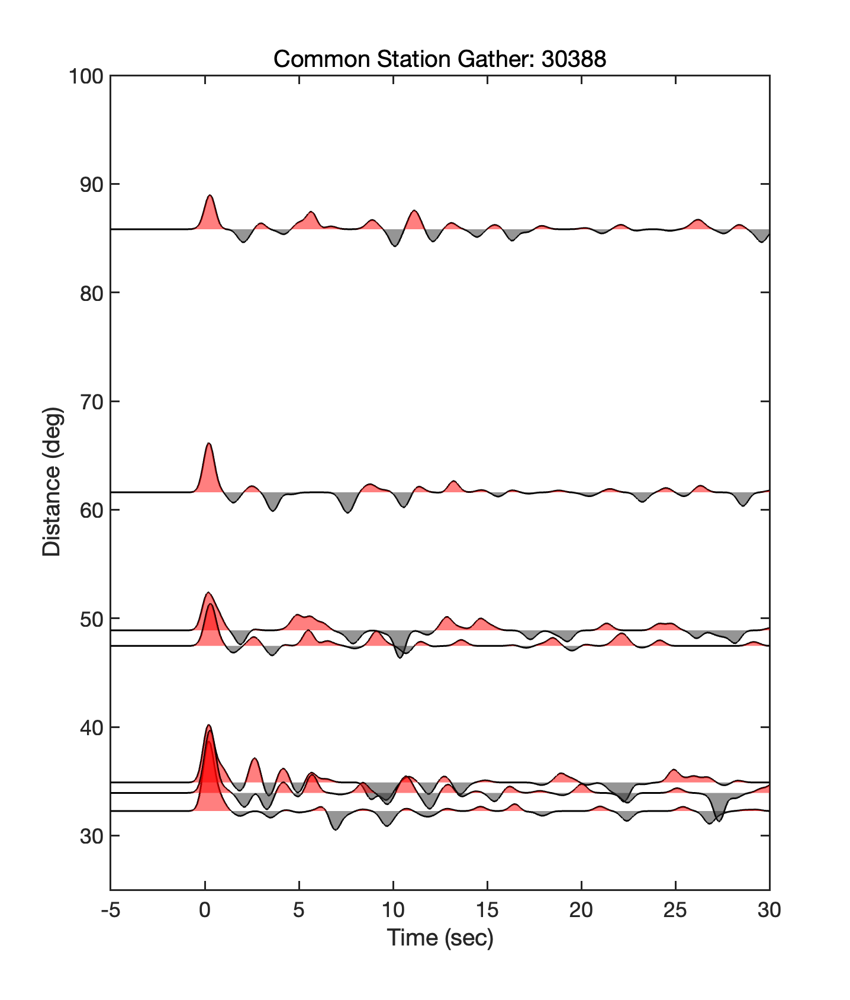

图 6-4 典型台站共台站接收函数道集

将同一远震事件在密集台阵不同台站得到的接收函数按台站位置排列，可观察转换震相沿剖面的横向变化（如[图 6-5](#_Ref339619482)）。0 s 附近各台站均表现出较一致的强正振幅响应，而后续转换信号在不同台站间具有一定连续性，同时局部发生明显变化。这说明密集台阵能够利用较小的台站间距连续采样地下结构，为进一步追踪地壳内部速度间断面及 Moho 横向变化提供了基础。

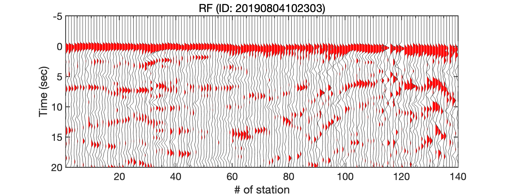

图 6-5 典型远震事件共事件接收函数道集

3\. **接收函数叠加与 Moho 初步识别**

接收函数叠加结果（如[图 6-6](#_Ref340291762)）显示，在约 50–60 km 深度范围内存在较连续的强转换能量带，可解释为 Moho 附近的 P-S 转换响应。根据该界面的空间位置进行拾取，研究区 Moho 深度总体约为51–58 km，并沿密集台阵剖面存在明显起伏，表明祁连山北缘—河西走廊地区地壳厚度具有一定横向非均一性。

<figure>
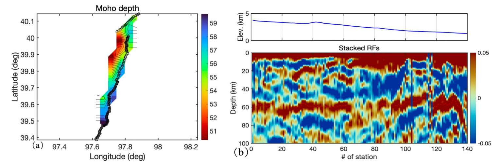
<figcaption>
图 6-6 接收函数叠加成像及莫霍面深度结果 
（a）沿台阵的 Moho 深度分布；（b）接收函数深度域叠加剖面
</figcaption>
</figure>

4.  **CCP成像及平滑参数试验**

CCP 成像前，根据台阵主轴方向将台站坐标投影至规则二维网格（如[图 6-7](#_Ref342073304)），并在此基础上进行转换点射线投影及空间叠加。

<figure>
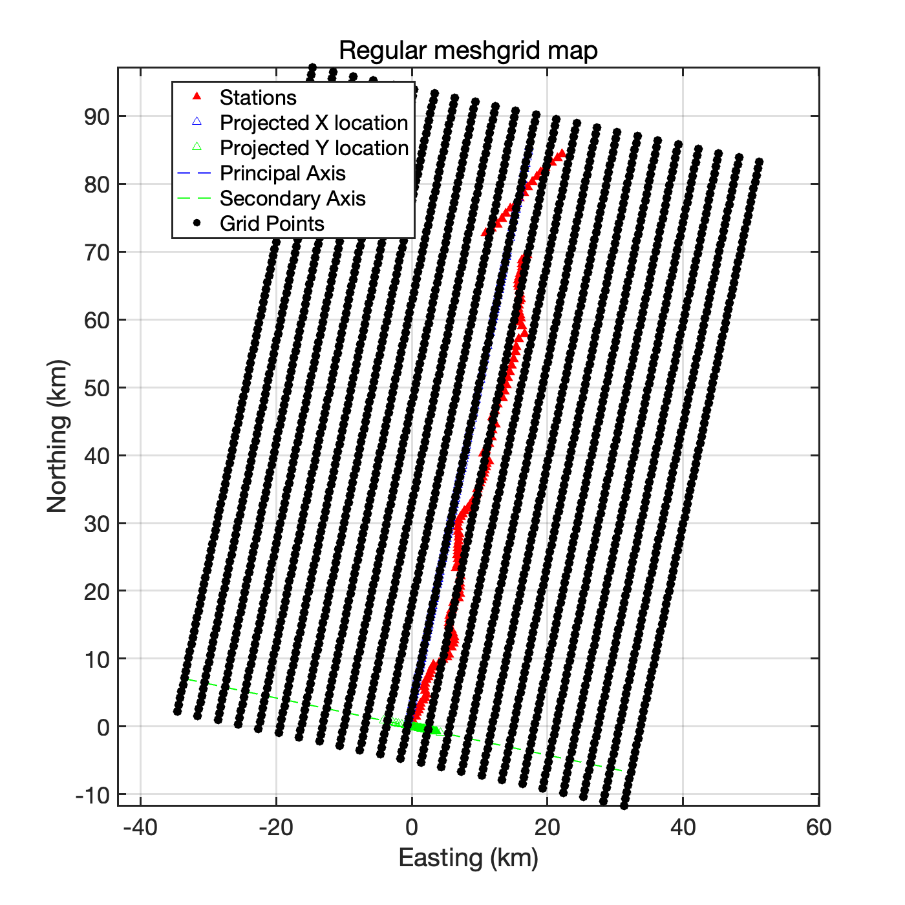
<figcaption>
图 6-7 CCP 成像坐标系及规则网格设置
</figcaption>
</figure>

为检验空间平滑对 CCP 成像结果的影响，本实验分别比较了不进行平滑（Param=0）和采用随深度增加的平滑半径（Param=1）两种方案（如[图 6-8](#_Ref342493479)）。不进行平滑时，CCP 剖面存在较多短波长、斑块状振幅变化，主要界面的横向连续性受到一定干扰；采用深度相关空间平滑后，小尺度非相干能量得到抑制，约 50–60 km 深度处的主要转换界面更加连续清晰。因此后续 Moho 识别采用平滑后的 CCP 结果。

<figure>
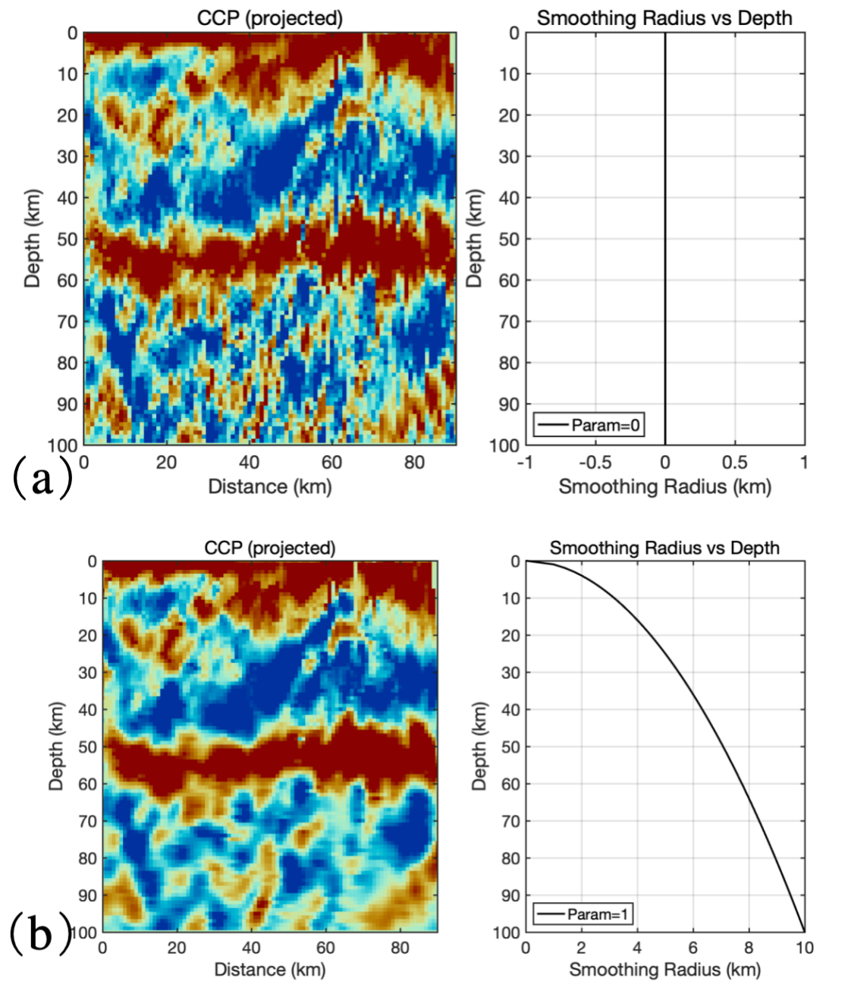
<figcaption>
图 6-8 不同空间平滑参数下的 CCP 成像结果对比（a）Smoothing=0；（b）Smoothing=1
</figcaption>
</figure>

5.  **CCP 最终结果与 Moho 拾取**

CCP 成像结果显示（如[图 6-9](#_Ref343619548)），在约 50–60 km 深度范围内存在较连续的强振幅转换界面（正振幅转换带）。根据该界面的横向连续性对 Moho 进行拾取，所得 Moho 深度整体约为 50–58 km，并沿剖面表现出一定的横向起伏。该结果表明祁连山北缘及邻近地区具有较厚的大陆地壳，同时 Moho 并非简单水平界面，而表现出较明显的横向变化。

<figure>
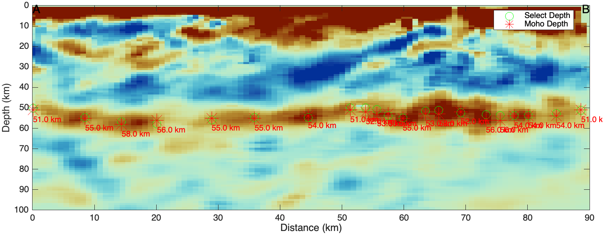
<figcaption>
图 6-9 CCP 接收函数成像剖面及 Moho 深度拾取结果
</figcaption>
</figure>

6.  **H–κ 叠加及参数敏感性分析**

本实验以30384台站为例进行 H–κ叠加分析，设置地壳厚度搜索范围为30-70 km，步长为0.1 km，Vp/Vs​搜索范围为1.5-2.2，步长为0.01。叠加结果显示（如[图 6-10](#_Ref344543933)），最大能量集中于 H=51.30 km、Vp/Vs=1.71 附近，所得地壳厚度和波速比分别为 51.30±2.01 km 和 1.71±0.03。最优解位于搜索范围内部，表明参数范围设置合理。并且，实验发现30384台站下方地壳厚度约为51 km，显示出较明显的地壳增厚特征，与祁连山区域背景相符合。Vp/Vs、约为1.71，处于大陆地壳常见范围内。H–κ高值区具有一定斜向展布特征，反映地壳厚度与 Vp/Vs之间存在一定参数权衡，因此结果应结合其不确定度进行解释。改变 H–κ 搜索范围后，主叠加峰位置基本稳定，说明所得地壳厚度及 Vp/Vs结果对搜索参数的依赖较弱。

<figure>
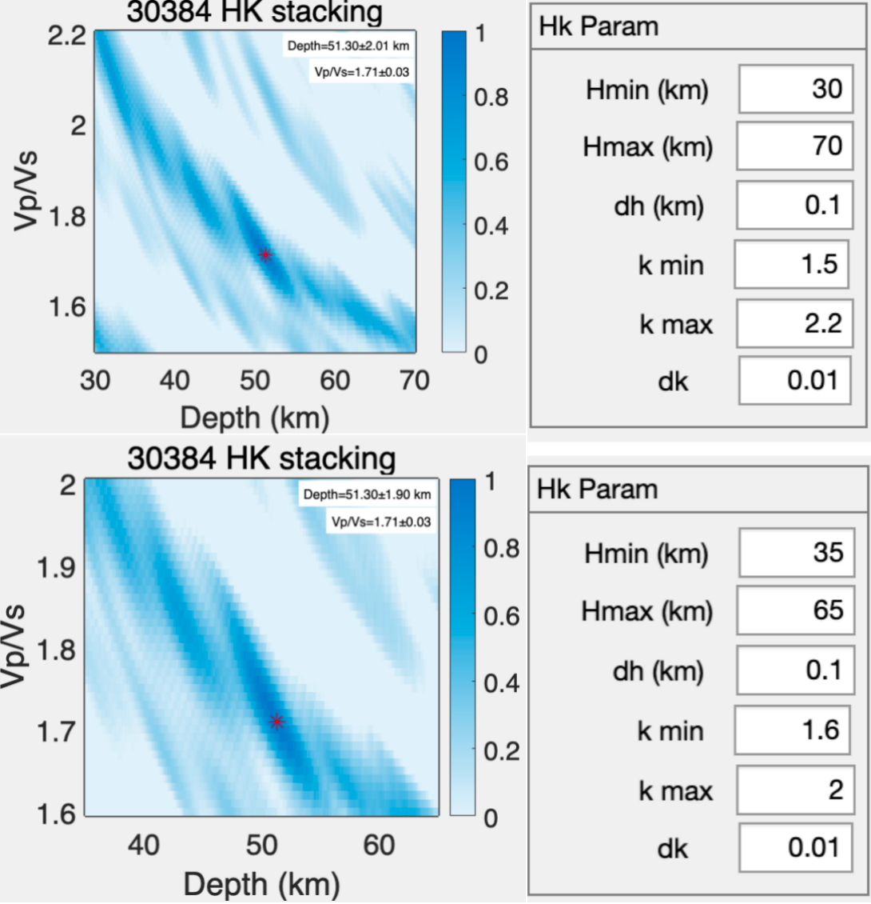
<figcaption>
图 6-10 30384 台站接收函数 H–κ 叠加结果（左）及其参数设置（右）
</figcaption>
</figure>

7.  **全台站数据H–κ 叠加结果分析**

    本实验设置质量控制指标为Hstd（即Standard Deviation of H，地壳厚度的标准差）≤8 km，kstd（即Standard Deviation of κ，波速比的标准差）≤0.20，即只要 Hstd \> 8 km 或 kstd \> 0.20，该台站即被剔除。统计得到的结果（如[表 6-1](#_Ref358897111)），可见，本批 H–κ 结果中主要的质量限制来自 H 的不确定度较大。并且统计中的离散程度采用样本标准差（n−1）表征。

    经质量控制后共获得53个较可靠H–κ结果（如[表 6-2](#_Ref359081988)）。全部53个有效台站的平均地壳厚度为 46.10±9.68 km，平均Vp/Vs为 1.855±0.213。并且按照 50 km 阈值划分后，可识别出两类明显不同的统计群体，即厚地壳组（55.92±3.94 km）和薄地壳组（38.57±4.59 km）；两组Vp/Vs分别为1.734±0.095和1.947±0.233，显示地壳厚度及波速比沿台阵存在显著横向差异。

    值得一提的是，由于研究区坐标范围已经跨过了祁连山-酒泉盆地的山盆过渡区域，合理推测厚地壳主要位于西南侧祁连山，薄地壳主要位于东北侧酒泉盆地，该推论与 Shen et al. (2020) 的区域密集台阵接收函数结果具有较好的一致性。后者发现祁连冲断带下方Moho平均深度约60 km，并具有明显起伏和分段特征，而北侧阿拉善块体Moho约45 km且较为平坦；河西走廊则构成由北侧薄地壳向祁连山厚地壳过渡的区域\[22\]（如[图 6-11](#_Ref345249827)）。同时我们的实验结果也与野外分析的P波接收函数成像剖面达成了较好一致性（如[图 6-12](#_Ref346510352)），即祁连山处的地壳部分由于增厚导致Moho更深，而酒泉盆地处则较薄，但总体范围都在40-60km之间。但由于目前，初步统计了厚薄地壳空间分布（如[表 6-3](#_Ref359350900)），但想得到具体可靠结论还需叠加山盆边界等其他多元信息进行判断，才能够使推论成为可靠的结论。

| 项目                     | 台站数 | 占原始数据 |
|--------------------------|--------|------------|
| 原始台站                 | 140    | 100%       |
| 通过质量控制             | 53     | 37.9%      |
| 剔除                     | 87     | 62.1%      |
| 仅因 Hstd \> 8 km 被剔除 | 55     | 39.3%      |
| 仅因 kstd \> 0.20 被剔除 | 7      | 5.0%       |
| Hstd、kstd 均超限        | 25     | 17.9%      |

表 6-1 全台站H–κ叠加结果质量控制统计

| 类别   | H划分      | 台站数 | H均值 ± 标准差 / km | H范围 / km  | k均值 ± 标准差 |
|--------|------------|--------|---------------------|-------------|----------------|
| 全台站 | 不区分H    | 53     | 46.10 ± 9.68        | 32.80-64.00 | 1.855 ± 0.213  |
| 厚地壳 | H ≥ 50 km  | 23     | 55.92 ± 3.94        | 50.00–64.00 | 1.734 ± 0.095  |
| 薄地壳 | H \< 50 km | 30     | 38.57 ± 4.59        | 32.80–49.80 | 1.947 ± 0.233  |

表 6-2 质量控制后H–κ叠加结果分组统计

| 纬度范围      | 厚地壳 H≥50 km | 薄地壳 H\<50 km | 主要特征         |
|---------------|----------------|-----------------|------------------|
| 39.40–39.60°N | 4              | 12              | 薄地壳占多数     |
| 39.60–39.80°N | 7              | 9               | 厚薄混合         |
| 39.80–40.00°N | 11             | 2               | 厚地壳明显占多数 |
| 40.00–40.12°N | 1              | 7               | 薄地壳明显占多数 |

表 6-3 厚薄地壳空间分布统计

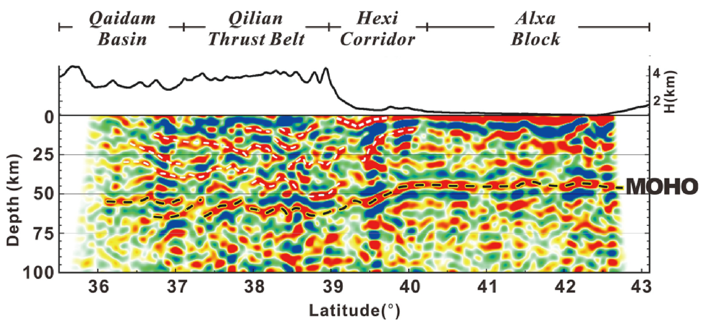

图 6-11 祁连山北缘及邻区 Moho 结构特征\[22\]（据 Shen et al., 2020修改）

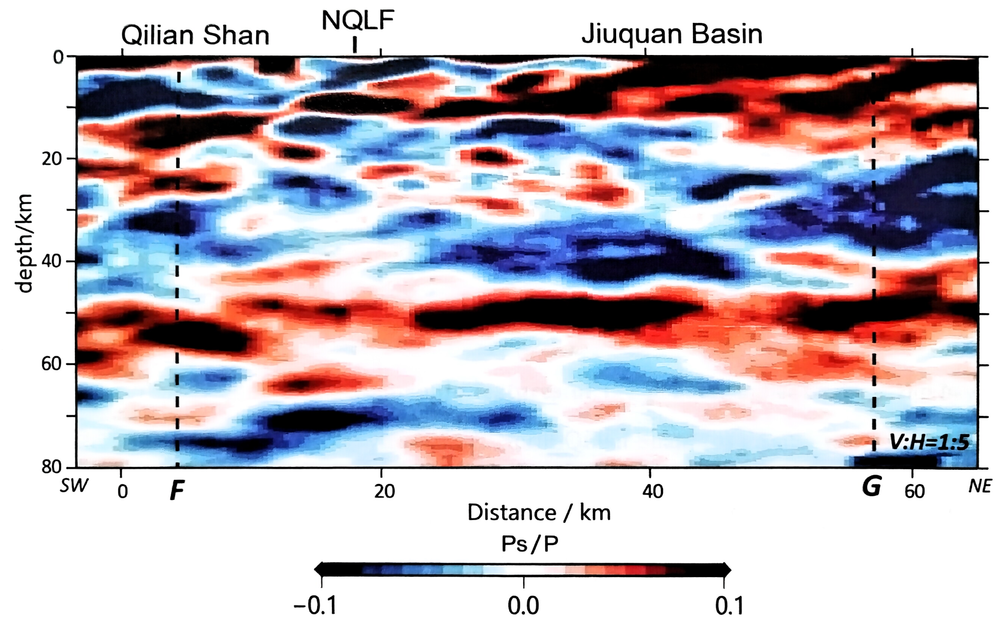

图 6-12 北祁连山北缘—酒泉盆地地壳的上地幔P波接收函数成像剖面\[23\]（据 Ye et al., 2021 修改）剖面自西南向东北依次穿过北祁连山、北祁连断裂（NQLF）和酒泉盆地；红色和蓝色分别表示正、负Ps/P转换振幅，垂直夸大比例为1∶5。

## 结论

本实验发现研究区的厚地壳区域总体具有较低的 Vp/Vs，说明其平均地壳成分可能以长英质—中性成分为主。倘若地壳增厚主要由大量基性物质向中下地壳注入或底侵造成，通常会使地壳平均 Vp/Vs 升高，因此这种“厚地壳—低 Vp/Vs”组合并不支持大规模基性物质增生是祁连山地壳增厚的主导机制\[24\]，而是支持地壳增厚是由长期挤压缩短造成的。

综合本实验结果与已有研究，祁连山北缘的深部岩石圈变形特征是以地壳整体缩短增厚为主的（倾向于支持纯剪式变形模式的）而非以水平剪切位移为主的单剪变形。
