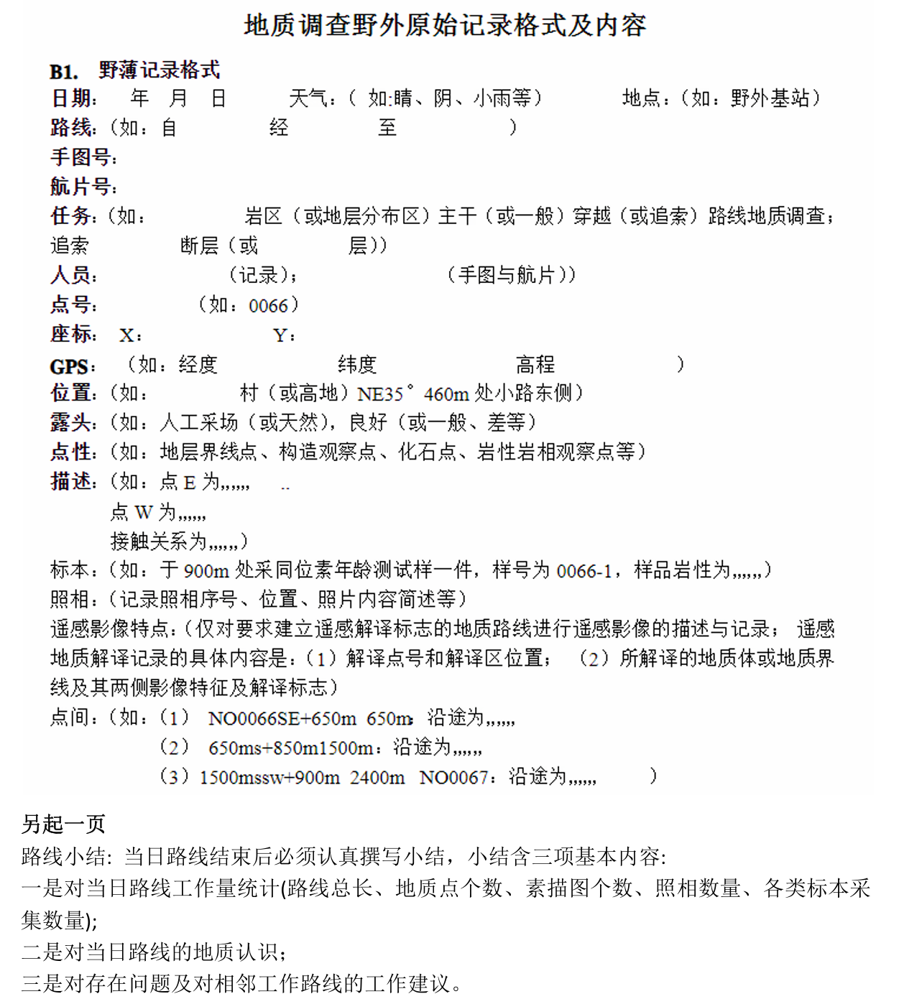

# 其他资料

## 填图实习资料

以下整理了巢湖地区地质填图实习相关背景知识，包括区域构造背景、地层层序、岩石描述方法以及地质构造特征等内容。

<iframe
src="/university-notes-site/courses/short-term-practice/geological-mapping/files/chaohu-geological-mapping.pdf"
width="100%"
height="900px">
</iframe>

## 野外地质调查记录格式

## 野外手册指导书电子版：
📄 [下载：野外地质简明手册.pdf](files/野外地质简明手册.pdf)

## 参考文献

这里整理了本人写实习报告用到的一些参考资料。

[1]巢湖市人民政府. 地理位置[EB/OL]. (2025-02-26)[2025-07-26].
https://www.chaohu.gov.cn/zjch/dlwz/index.html

[2]新京报. 安徽宣布撤销地级巢湖市 原辖区县“一分为三”[EB/OL]. (2011-08-22)
[2025-07-26].https://www.bjnews.com.cn/detail/155144085714931.html

[3]巢湖市人民政府. 行在巢湖[EB/OL].(2025-01-20)[2025-07-26].   https://www.chaohu.gov.cn/wzq/zfgbmwzdh/swlj/qyly/lygl/xzch/index.html

[4]巢湖市人民政府. 2019年自然资源[EB/OL]. (2020-04-29)[2025-07-26]. https://www.chaohu.gov.cn/sjch/tjsj/zrzy/11079819.html

[5]巢湖市人民政府. 巢湖概况[EB/OL]. (2025-02-26)[2025-07-26]. https://www.chaohu.gov.cn/wzq/zfgbmwzdh/swlj/qyly/mlch/chgk/index.html

[6]陈宁华, 胡程青, 程晓敢. 野外地质简明手册——安徽巢北区域地质填图实习指导[M]. 杭州: 浙江大学出版社, 2015: 206-227.

[7]张利伟.安徽巢湖地区早三叠世和龙山组沉积环境变化及其生物学响应[D].合肥：合肥工业大学，2010.

[8]张钰莹等.安徽巢湖下三叠统含巢湖龙动物群地层微相特征及古环境[J]. 地层学杂志，2014，38(5): 761–768.

[9]王子玉.用MnO/TiO₂指标探讨安徽巢湖二叠系海陆相的变化[J].地层学杂志，1989，13(4): 289–297.

[10]杨文莉等.安徽巢湖凤凰山晚古生代大冰期沉积特征与碳同位素变化[J].地层学杂志，2021，45(1): 38–48.

[11]舒良树. 华南构造演化的基本特征[J]. 地质通报, 2012, 31(7):1035-1053.

[12]刘柯, 宋立军, 刘学锋. 巢湖北部褶皱构造变形特征及其构造物理模拟[J]. 东华大学学报（自然科学版）, 2022, 48(1): 12-16.

[13]李忠权，刘顺. 构造地质学[M].北京:地质出版社，2010.

[14]冯文瑞. 巢湖北部地区构造变形叠加改造过程及其动力学机制分析[D]. 西安: 西安石油大学, 2014.

[15]宋佳伟, 赵鲁阳, 吕大炜. 巢湖地区五通组砂岩岩石学特征[J]. 中国煤炭地质 2016, 28(04): 41-44.

[16]赵澄林. 试论安徽巢县五通组沉积相[J]. 石油与天然气地质, 1988, 9(1): 40-45.

[17]李星学，蔡重阳，欧阳舒.长江下游五通组研究的新进展[J].中国地质科学院院报，1984(2):119-133.

[18]张国栋，朱静昌，王益友，等.苏、皖地区晚泥盆世五通组海侵及其沉积环境讨论[J].地质评论，1987，33(1):69-79.

[19]张国栋，朱静昌，王益友.对下扬子区五通组沉积的新认识[J].中国科学（B辑），1991，(4):416-423.

[20]李汉民, 蓝善先. 安徽巢县上泥盆统五通组上部植物化石[J]. 植物学报，1984.26(2):223-225.

[21]赵鲁阳, 吕大炜, 刘海燕, 等. 安徽巢北地区五通组沉积环境分析[J]. 沉积学报, 2015, 33(3): 470-479.

[22] De Vleeschouwer, D. et al. Timing and pacing of the Late Devonian mass extinction event regulated by eccentricity and obliquity. Nat. Commun. 8, 2268 (2017).