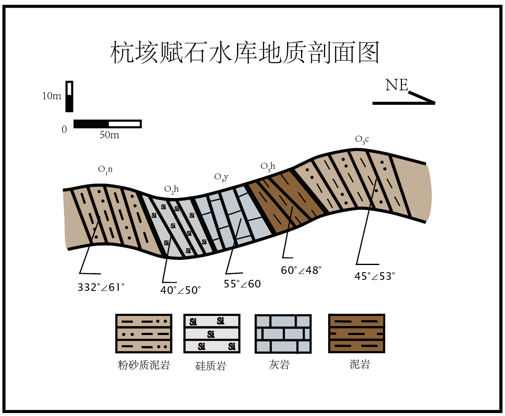
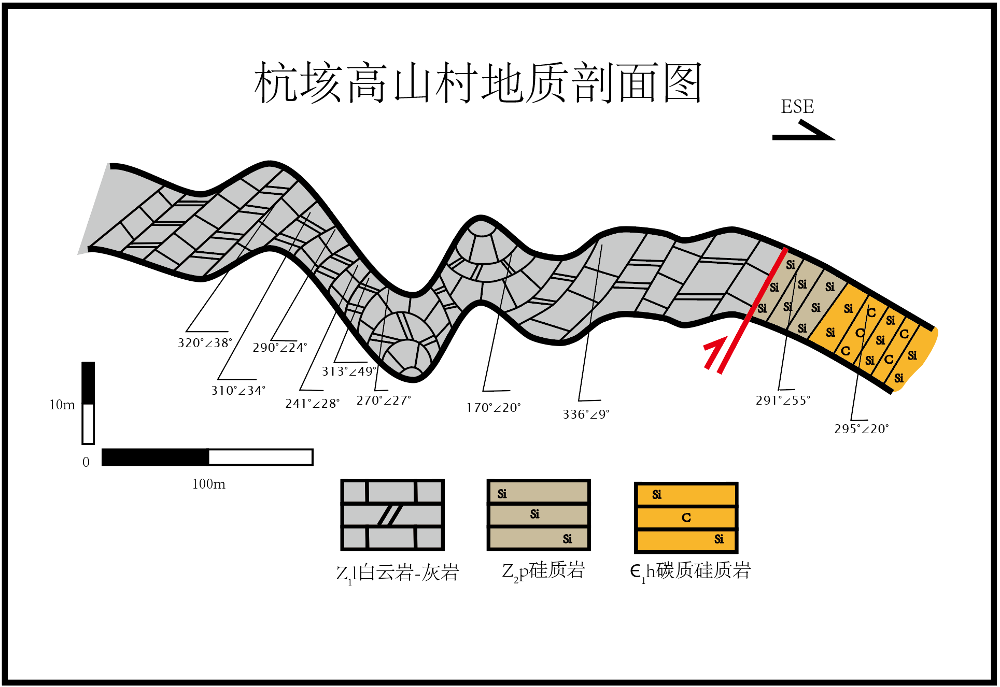
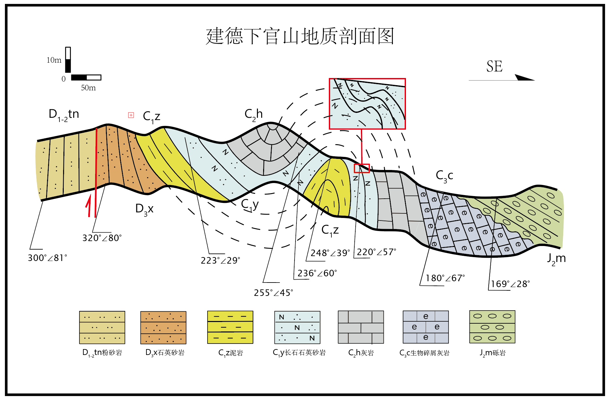
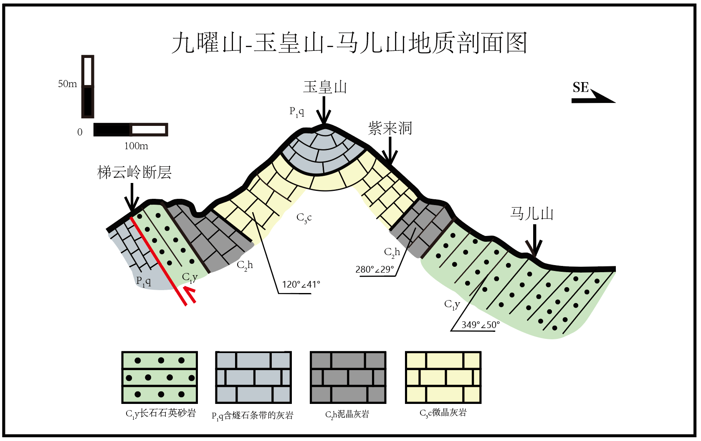
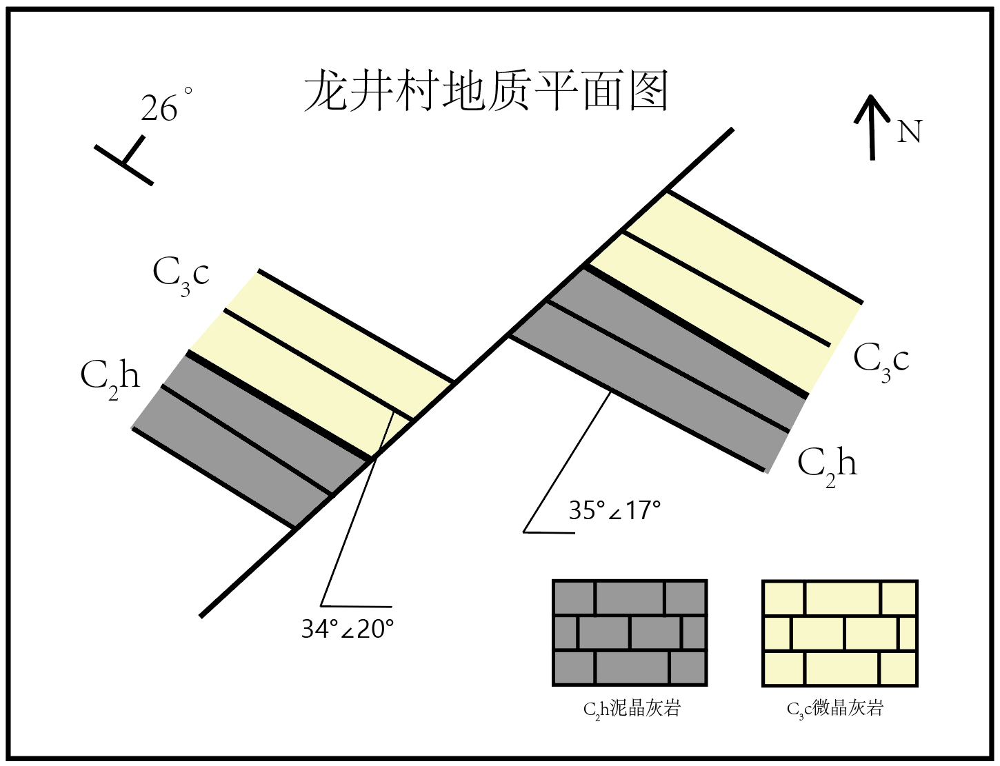
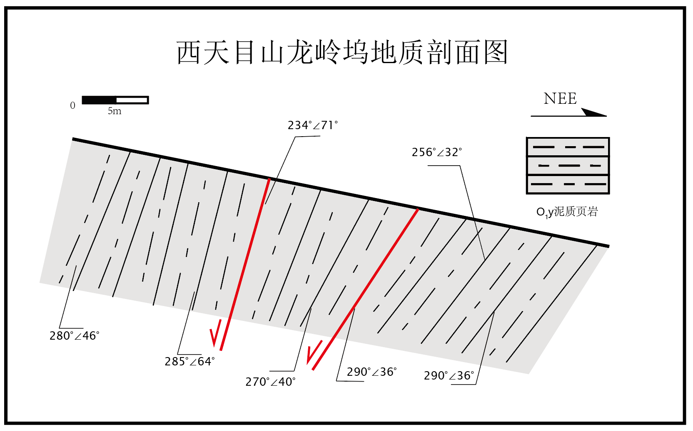

# 地质认知实习

## 课程简介

作为本科阶段较早的一次地质实习，本页面主要保留课程经历及部分制图成果，不再详细整理原有实习报告。

地质认知实习是本科阶段第一次较系统的野外地质实践课程，主要在浙江省内开展，实习区域包括杭州西湖、安吉杭垓、诸暨陈蔡、建德、西天目山及雁荡山等地。课程以基础地质现象识别和野外工作方法训练为主，涉及地层、岩石、褶皱、断层、岩脉、地貌及古生物等内容，并初步学习地质罗盘使用、野簿记录、岩石标本采集以及地质平面图与剖面图绘制。

实习时间为2024.7.4-2024.7.23，主要都是野外踏勘（第一天是实习动员，野外也包括一些思政内容，例如参观自然博物馆，最后一天是实习综合考试，考试形式是在野外观察一处露头然后在野外当地就完成信手剖面图）；并且由于涉及地区多，经常需要换民宿住，洗衣服可能不是很方便，可以买一次性的内裤和袜子，并且通常需要自带吹风机、衣架以及洗浴用品（睡觉的时候可能随机刷新蝙蝠或者其他动物盲盒），衣服由于天气热通常很快会干，不过也建议多带几套（按理而言至少3套就够了）；然后每天都会发瓶水；我们的带队老师为龚俊锋、郝艳涛老师。然后比较头大的一点是每天每组都需要汇报！！如果遇上比较摆烂的组员而你恰好是组长那可能会比较牢了（大哭.jpg）。

## 制图成果

制图主要用到adobe illustrator，注册登陆学校邮箱“学号@.zju.edu.cn”就会跳转浙大统一身份验证页面（相当于学校已经买下了一系列adobe软件使用权），然后一些基本操作的教学在哔哩哔哩上面有，应该还是很好上手的（我记得我们那个时候还没有这种教程，只有illustrator自带的一些教程，所以还花了相当经历去熟悉软件，当然老师也会简单教一下软件使用～）

### 杭垓赋石水库地质剖面图

### 杭垓高山村地质剖面图

### 建德下官山地质剖面图

### 九曜山—玉皇山—马儿山地质剖面图

### 龙井村地质平面图

### 西天目山龙岭坞地质剖面图

